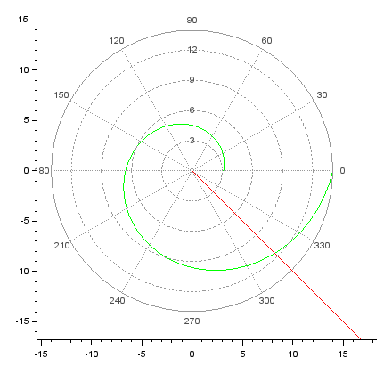
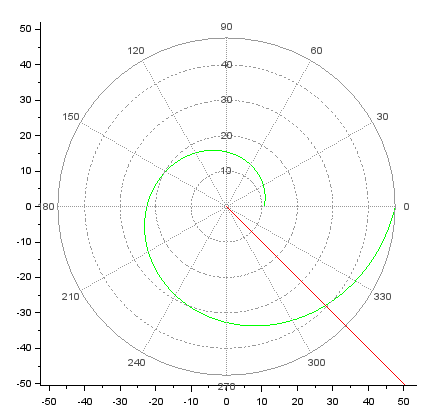
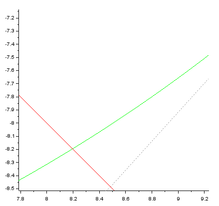
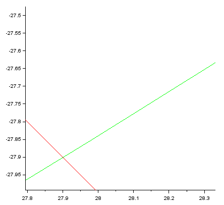

# Лабораторная работа №2
## Ilyinsky A. Arseniy 
## RUDN University, 2022 Moscow, Russia

--- 

# Прагматика выполнения лабораторной работы

---

### Прагматика выполнения лабораторной работы:
- Изучение основ математического моделирования.
- Умение строить траектории движения в теории и визуализировать их.

--- 

# Цель лабораторной работы

---

### Цель лабораторной работы:
- Рассмотреть построение математических моделей для выбора правильно стратегии при решении задач поиска на примере задачи преследования браконьеров береговой охраной.

---

# Задание лабораторной работы

---

### Задание лабораторной работы:
1. Запишите уравнение, описывающее движение катера, с начальными условиями для двух случаев (в зависимости от расположения катера относительно лодки в начальный момент времени). 
2. Постройте траекторию движения катера и лодки для двух случаев.
3. Найдите точку пересечения траектории катера и лодки.

---

# Результаты выполнения лабораторной работы

---

### 1. Выведение уравнения, описывающее движение катера:
1. Находим расстояние $x$ (расстояние после которого катер начнет двигаться вокруг полюса):
    - Первый случай: $x_1=\frac{k}{5.3}$
    - Второй случай: $x_2=\frac{k}{3.3}$
2. Раскладываем скорость катера на две состовляющие:
    - Радиальная: $v_r=\frac{dr}{dt}=v$
    - Тангенциальная скорость: $v_{\tau}=r\frac{dθ}{dt}=\sqrt{17.49}v$
3. Составим систему из двух дифференциальных уравнений:
    $\begin{cases} \frac{dr}{dt}=v \\ r\frac{dθ}{dt}=\sqrt{17.49}v \end{cases}$ с начальными условиями $\begin{cases} θ_0=0 \\ r_0=x_1 \end{cases}$ или $\begin{cases} θ_0=-\pi \\ r_0=x_2 \end{cases}$
    и переходим к следующему уравнению: $\frac{dr}{dθ}=\frac{r}{\sqrt{17.49}}$

---

### 2. Построение траектории движения катера и лодки:
- Первый случай:
#### 
##### Рис.1 График траектории движения

---

- Второй случай:
#### 
##### Рис.2 График траектории движения

---

### 3. Поиск точки пересечения траектории катера и лодки:
- Первый случай:
#### 
##### Рис.3 Точка пересечения траекторий движений

---

- Второй случай:
#### 
##### Рис.4 Точка пересечения траекторий движений

---

# Спасибо за внимание