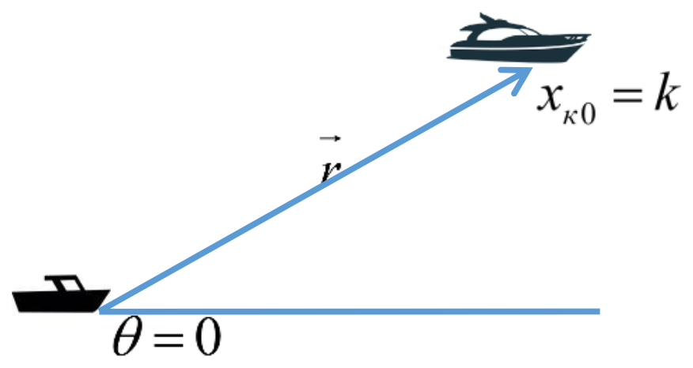
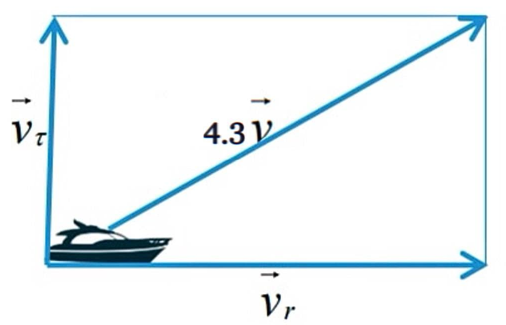
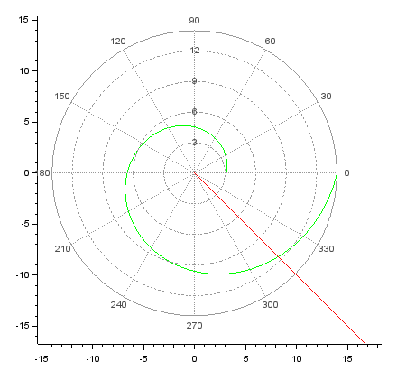
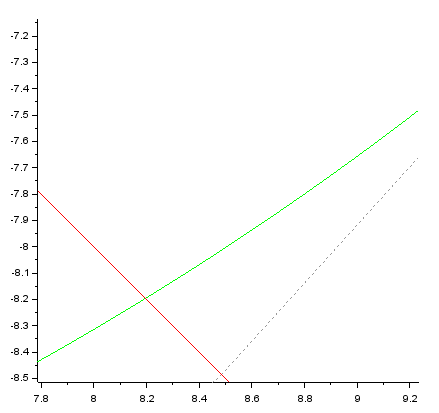
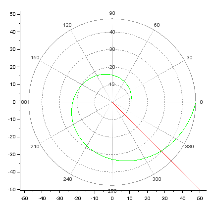
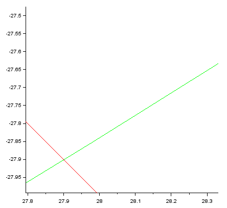

---
# Front matter
lang: ru-RU
title: "Лабораторная работа №2"
subtitle: "Математическое моделирование"
author: "Ильинский Арсений Александрович"

# Formatting
toc-title: "Содержание"
toc: true # Table of contents
toc_depth: 2
lof: true # List of figures
lot: true # List of tables
fontsize: 12pt
linestretch: 1.5
papersize: a4paper
documentclass: scrreprt
polyglossia-lang: russian
polyglossia-otherlangs: english
mainfont: PT Serif
romanfont: PT Serif
sansfont: PT Sans
monofont: PT Mono
mainfontoptions: Ligatures=TeX
romanfontoptions: Ligatures=TeX
sansfontoptions: Ligatures=TeX,Scale=MatchLowercase
monofontoptions: Scale=MatchLowercase
indent: true
pdf-engine: lualatex
header-includes:
  - \usepackage[russian]{babel}
  - \linepenalty=10 # the penalty added to the badness of each line within a paragraph (no associated penalty node) Increasing the value makes tex try to have fewer lines in the paragraph.
  - \interlinepenalty=0 # value of the penalty (node) added after each line of a paragraph.
  - \hyphenpenalty=50 # the penalty for line breaking at an automatically inserted hyphen
  - \exhyphenpenalty=50 # the penalty for line breaking at an explicit hyphen
  - \binoppenalty=700 # the penalty for breaking a line at a binary operator
  - \relpenalty=500 # the penalty for breaking a line at a relation
  - \clubpenalty=150 # extra penalty for breaking after first line of a paragraph
  - \widowpenalty=150 # extra penalty for breaking before last line of a paragraph
  - \displaywidowpenalty=50 # extra penalty for breaking before last line before a display math
  - \brokenpenalty=100 # extra penalty for page breaking after a hyphenated line
  - \predisplaypenalty=10000 # penalty for breaking before a display
  - \postdisplaypenalty=0 # penalty for breaking after a display
  - \floatingpenalty = 20000 # penalty for splitting an insertion (can only be split footnote in standard LaTeX)
  - \raggedbottom # or \flushbottom
  - \usepackage{float} # keep figures where there are in the text
  - \floatplacement{figure}{H} # keep figures where there are in the text
---

# Цель работы

Рассмотреть построение математических моделей для выбора правильной стратегии при решении задач поиска на примере задачи преследования браконьеров береговой охраной.

# План работы

- ## Постановка задачи

- ## Построение траектории движения и поиск точки пересечения

# Задание

**Вариант 46**

На море в тумане катер береговой охраны преследует лодку браконьеров. Через определенный промежуток времени туман рассеивается, и лодка обнаруживается на расстоянии 16,5 км от катера. Затем лодка снова скрывается в тумане и уходит прямолинейно в неизвестном направлении. Известно, что скорость катера в 4,3 раза больше скорости браконьерской лодки:

1. Запишите уравнение, описывающее движение катера, с начальными
условиями для двух случаев (в зависимости от расположения катера
относительно лодки в начальный момент времени).

2. Постройте траекторию движения катера и лодки для двух случаев.

3. Найдите точку пересечения траектории катера и лодки 

# Выполнение лабораторной работы

## 1. Постановка задачи

1. Принимаем за $t_0=0$, $x_{л0}$ - место нахождения лодки браконьеров в момент обнаружения,  а за $x_{к0}=16.5$ - место нахождения катера береговой охраны относительно лодки браконьеров в момент обнаружения лодки. 

2. Введем полярные координаты. Считаем, что полюс - это точка обнаружения лодки браконьеров $x_{л0} (θ=x_{л0}=0)$, а полярная ось $r$ проходит через точку нахождения катера береговой охраны. (рис. [-@fig:001])
	
	{#fig:001 width=70%}

3. Траектория катера должна быть такой, чтобы и катер, и лодка все время были на одном расстоянии от полюса $θ$, только в этом случае траектория катера пересечется с траекторией лодки. 

   Поэтому для начала катер береговой охраны должен двигаться некоторое время прямолинейно, пока не окажется на том же расстоянии от полюса, что и лодка браконьеров. После этого катер береговой охраны должен двигаться вокруг полюса удаляясь от него с той же скоростью, что и лодка браконьеров. 

4. Чтобы найти расстояние $x$ (расстояние после которого катер начнет двигаться вокруг полюса), необходимо составить простое уравнение. Пусть через время $t$ катер и лодка окажутся на одном расстоянии *x* от полюса. За это время лодка пройдет $x$, а катер $k-x$ (или $k+x$ в зависимости от начального положения катера относительно полюса). Время, за которое они пройдут это расстояние, вычисляется как $x/v$ или $k-x/4.3v$ (во втором случае  $k+x/4.3v$). Так как время одно и то же, то эти величины одинаковы. Тогда неизвестное расстояние $x$ можно найти из следующего уравнения: 

   $\frac{x}{v}=\frac{k-x}{4.3v}$ в первом случае или 

   $\frac{x}{v}=\frac{k+x}{4.3v}$ во втором.

   Отсюда мы найдем два значения $x_1=\frac{k}{5.3}=\frac{16.5}{5.3}$ и $x_2=\frac{k}{3.3}=\frac{16.5}{3.3}$, задачу будем решать для двух случаев.
   
5. После того, как катер береговой охраны окажется на одном расстоянии от полюса, что и лодка, он должен сменить прямолинейную траекторию и начать двигаться вокруг полюса удаляясь от него со скоростью лодки $v$. 

   Для этого скорость катера раскладываем на две составляющие: $v_r$ - радиальная скорость и $v_{\tau}$ - тангенциальная скорость. (рис. [-@fig:002])

	{#fig:002 width=70%}

   - Радиальная скорость - это скорость, с которой катер удаляется от полюса, $v_r=\frac{dr}{dt}$. Нам нужно, чтобы эта скорость была равна скорости лодки, поэтому полагаем $\frac{dr}{dt}=v$;
   
   - Тангенциальная скорость – это линейная скорость вращения катера относительно полюса. Она равна произведению угловой скорости $\frac{dθ}{dt}$ на радиус $r$, $v_{\tau}=r\frac{dθ}{dt}$;

   Из рисунка видно (рис. [-@fig:002]): $v_{\tau}=\sqrt{18.49v^2-v^2}=\sqrt{17.49}v$
   
   **Замечание:** учитывая, что радиальная скорость равна $v$.
   
   Тогда получаем: $r\frac{dθ}{dt}=\sqrt{17.49}v$
   
5. Решение исходной задачи сводится к решению системы из двух дифференциальных уравнений:

   $\begin{cases} \frac{dr}{dt}=v \\ r\frac{dθ}{dt}=\sqrt{17.49}v \end{cases}$ с начальными условиями $\begin{cases} θ_0=0 \\ r_0=\frac{16.5}{5.3} \end{cases}$ или $\begin{cases} θ_0=-\pi \\ r_0=\frac{16.5}{3.3} \end{cases}$
   
   Исключая из полученной системы производную по t, можно перейти к следующему уравнению:
   
   $\frac{dr}{dθ}=\frac{r}{\sqrt{17.49}}$
   
   Начальные условия остаются прежними. Решив это уравнение, мы получим траекторию движения катера в полярных координатах.

## 2. Построение траектории движения и поиск точки пересечения

1. **Первый случай:**

   - Расстояние $x$ (расстояние после которого катер начнет двигаться вокруг полюса):

      $$x_1=\frac{k}{5.3}=\frac{16.5}{5.3}$$
   
   - Код программы:

      ```matlab
      s=16.5; //начальное расстояние от лодки до катера
      fi=3*%pi/4; //направление движения лодки в полярных координатах
      
      //функция, описывающая движение катера береговой охраны
      function dr=f(tetha,r)
          dr=r/sqrt(17.49);
      endfunction;
      
      //начальное условие в случае 1
      r0=s/5.3;
      tetha0=0;
      
      //тета изменяется от 0 до 2пи с шагом 0.01, описывая полный круг
      tetha=0:0.01:2*%pi;
      
      //решение диф. ур. в случае 1
      r=ode(r0,tetha0,tetha,f);
      
      //функция, описывающая движение лодки браконьеров
      function xt=f2(t)
          xt=tan(fi)*t;
      endfunction;
      
      //время изменяется от 0 до 800 с шагом 1
      t=0:1:800;
      
      //траектория движения катера в полярных координатах в случае 1
      polarplot(tetha,r,style=color('green'));
      //тракетория движения лодки браконьеров
      plot2d(t,f2(t),style=color('red'));
      ```

   - График траектории движения катера и лодки (рис. [-@fig:003]):

      {#fig:003 width=70%}

      *Пояснение:*
      
        - <span style="color:green">зеленый</span> - катер береговой охраны;
        - <span style="color:red">красный</span> - лодка браконьеров;

   - Точка пересечения траектории катера и лодки (рис. [-@fig:004]):

      {#fig:004 width=70%}

      *Пояснение:* точка пересечения - $(8.2;-8.2)$. В данном случае браконьеры преодолели расстояние на лодке в $11.59 км$.

2. **Второй случай:**
	
   - Расстояние $x$ (расстояние после которого катер начнет двигаться вокруг полюса):
	
      $x_2=\frac{k}{3.3}=\frac{16.5}{3.3}$
	
   - Код программы:

      ```matlab
      s=16.5; //начальное расстояние от лодки до катера
      fi=3*%pi/4; //направление движения лодки в полярных координатах
      
      //функция, описывающая движение катера береговой охраны
      function dr=f(tetha,r)
          dr=r/sqrt(17.49);
      endfunction;
      
      //начальное условие в случае 2
      r0=s/3.3
      tetha0=-%pi;
      
      //тета изменяется от 0 до 2пи с шагом 0.01, описывая полный круг
      tetha=0:0.01:2*%pi;
      
      //решение диф. ур. в случае 2
      r=ode(r0,tetha0,tetha,f);
      
      //функция, описывающая движение лодки браконьеров
      function xt=f2(t)
          xt=tan(fi)*t;
      endfunction;
      
      //время изменяется от 0 до 800 с шагом 1
      t=0:1:800;
      
      //траектория движения катера в полярных координатах в случае 2
      polarplot(tetha,r,style=color('green'));
      //тракетория движения лодки браконьеров
      plot2d(t,f2(t),style=color('red'));
     ```

   - График траектории движения катера и лодки (рис. [-@fig:005]):
   
      {#fig:005 width=70%}

      *Пояснение:*
   
        - <span style="color:green">зеленый</span> - катер береговой охраны;
        - <span style="color:red">красный</span> - лодка браконьеров;

   - Точка пересечения траектории катера и лодки (рис. [-@fig:006]):
   
      {#fig:006 width=70%}
   
      *Пояснение:* точка пересечения - $(27.9;-27.9)$. В данном случае браконьеры преодолели расстояние на лодке в $39.45 км$.

# Выводы

Благодаря данной лабораторной работе познакомился с «задачей о погоне» и научился решать её, выполняя следующие шаги:

- записать уравнение, описывающее движение катера, с начальными условиями для двух случаев ( в зависимости от расположения катера относительно лодки в начальный момент времени );

- построить траекторию движения и катера и лодки для случаев;

- найти точку пересечения траектории катера и лодки;

# Список литературы

- <code>[Кулябов Д. С. *Лабораторная работа №2*](https://esystem.rudn.ru/mod/resource/view.php?id=831032)</code>

- <code>[Кулябов Д. С. *Задания к лабораторной работе №2 ( по вариантам )*](https://esystem.rudn.ru/mod/resource/view.php?id=831033)</code>