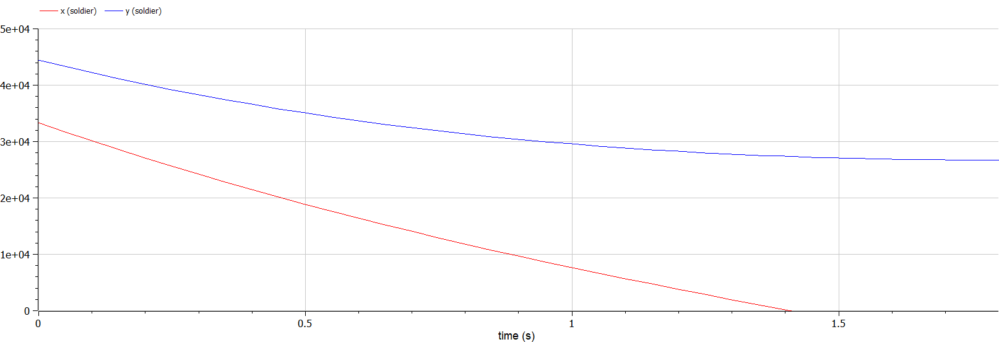
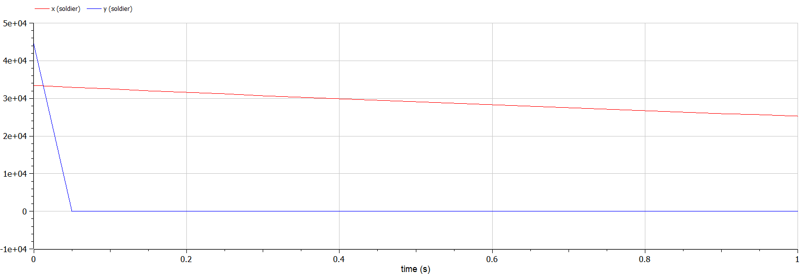

# Лабораторная работа №3
## Ilyinsky A. Arseniy 
## RUDN University, 2022 Moscow, Russia

--- 

# Прагматика выполнения лабораторной работы

---

### Прагматика выполнения лабораторной работы:
- Ознакомление с простейшей моделью боевых действий - моделью Ланчестера (Осипова — Ланчестера), которая применяется в военном деле для расчета потерь.
- Получение навыков визуализации изменения численности войск.

--- 

# Цель лабораторной работы

---

### Цель лабораторной работы:
- Познакомиться с пройстешими моделями боевых действий - моделями Ланчестера (Осипова — Ланчестера), а именно научиться:
    - решать дифференциальные уравнения, описывающие поведение численности армий в ходе боевых действий.
    - строить графики изменения численности войск. 

---

# Задание лабораторной работы

---

### Задание лабораторной работы:
Построить графики изменения численности войск армии $X$ и армии $Y$ для
следующих случаев:
1. Модель боевых действий между регулярными войсками:
$\frac{dx}{dt}=-0.15x(t)-0.64y(t)+|sin(t+15)|$
$\frac{dy}{dt}=-0.55x(t)-0.12y(t)+|cos(t+25)|$
2. Модель ведение боевых действий с участием регулярных войск и партизанских отрядов:
$\frac{dx}{dt}=-0.28x(t)-0.745y(t)+|2sin(3t)|$
$\frac{dx}{dt}=-0.613x(t)y(t)-0.35y(t)+|1.5cos(2t)|$

---

# Результаты выполнения лабораторной работы

---

### 1. Построение модели:
- Модель боевых действий между регулярными войсками:

    $\frac{dx}{dt}=-a(t)x(t)-b(t)y(t)+P(t)$

    $\frac{dy}{dt}=-c(t)x(t)-h(t)y(t)+Q(t)$

    таким образом, мы получаем следущие значения величин:
    |$a(t)=0.15$|$b(t)=0.64$|
    |---|---|
    |$c(t)=0.55$|$h(t)=0.12$|
    |$P(t)=\lvert{sin(t+15)\rvert}$|$Q(t)=\lvert{cos(t+25)\rvert}$|
    
---

- Модель ведение боевых действий с участием регулярных войск и партизанских отрядов:

    $\frac{dx}{dt}=-a(t)x(t)-b(t)y(t)+P(t)$

    $\frac{dy}{dt}=-c(t)x(t)y(t)-h(t)y(t)+Q(t)$

    таким образом, мы получаем следущие значения величин:
    |$a(t)=0.28$|$b(t)=0.745$|
    |---|---|
    |$c(t)=0.613$|$h(t)=0.35$|
    |$P(t)=\lvert{2sin(3t)\rvert}$|$Q(t)=\lvert{1.5cos(3t)\rvert}$|

---

### 2. Построение графиков изменения численности войск армий:
- Модель боевых действий между регулярными войсками:
#### 
##### Рис.1 График изменения численности войск армии $X$ и $Y$

---

- Модель ведение боевых действий с участием регулярных войск и партизанских отрядов:
#### 
##### Рис.2 График изменения численности войск армии $X$ и $Y$

---

# Спасибо за внимание