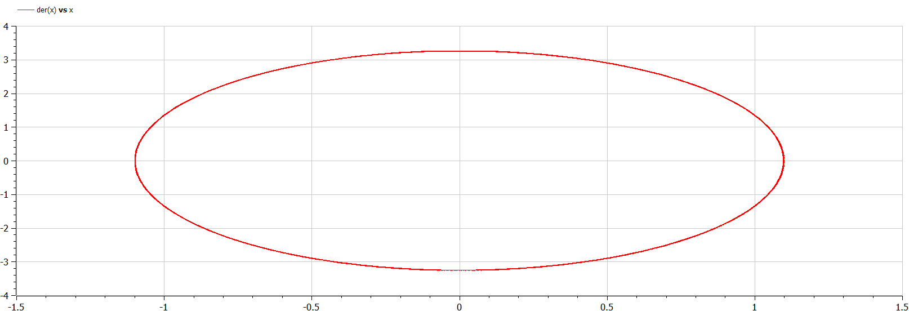
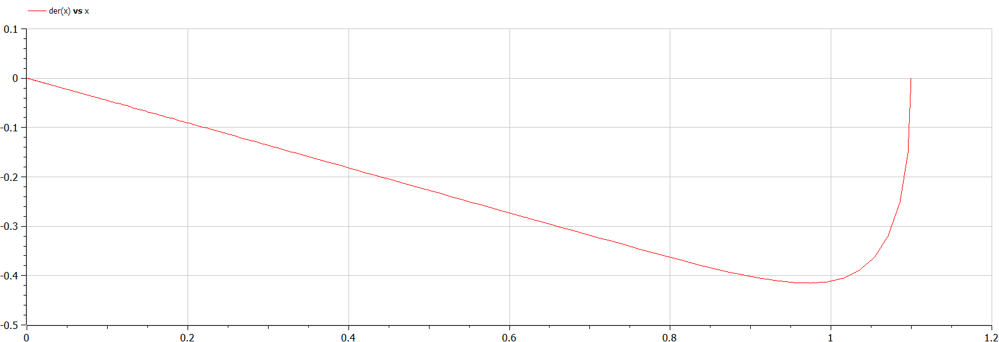
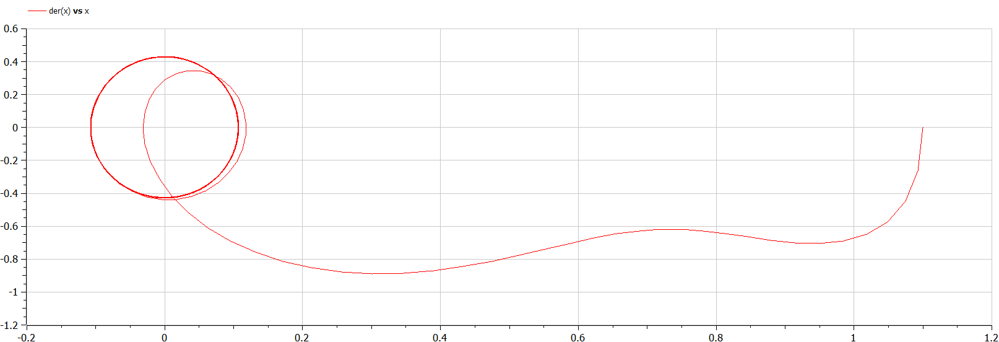

# Лабораторная работа №4
## Ilyinsky A. Arseniy 
## RUDN University, 2022 Moscow, Russia

--- 

# Прагматика выполнения лабораторной работы

---

### Прагматика выполнения лабораторной работы:
- Знакомоство с моделями гармонических колебаний с затуханием и без, под
действием внешних сил и без.
- Получение навыков визуализации результатов моделирования путем построения фазовых портретов.

--- 

# Цель лабораторной работы

---

### Цель лабораторной работы:
- Познакомиться с моделями гармонических колебаний, а именно:
    - научиться строить модели гармонических колебаний с затуханием и без, под действием внешних сил и без.
    - научиться решать систему дифференциальных уравнений и визуализровать фазовые портреты.

---

# Задание лабораторной работы

---

### Задание лабораторной работы:
Постройте фазовый портрет гармонического осциллятора и решение уравнения гармонического осциллятора для следующих случаев:
1. Колебания гармонического осциллятора без затуханий и без действий внешней силы:
$\ddot{x}+8.8x=0$
2. Колебания гармонического осциллятора c затуханием и без действий внешней силы:
$\ddot{x}+7.7\dot{x}+3.3x=0$
3. Колебания гармонического осциллятора c затуханием и под действием внешней силы:
$\ddot{x}+4.4\dot{x}+5.5x=2.2sin(4t)$

На интервале $t\in[0;55]$ (шаг $0.05$) с начальными условиями $x_0=1.1$, $y_0=0$.

---

# Результаты выполнения лабораторной работы

---

### 1. Построение модели:
1. Уравнение $\ddot{x}+8.8x=0$ приводится к системе вида:
$\begin{cases} \dot{x}=y \\ \dot{y} = -8.8x \end{cases}$
2. Уравнение $\ddot{x}+7.7\dot{x}+3.3x=0$ приводится к системе вида:
$\begin{cases} \dot{x}=y \\ \dot{y}=-7.7y-3.3x \end{cases}$
3. Уравнение $\ddot{x}+4.4\dot{x}+5.5x=2.2sin(4t)$ приводится к системе вида:
$\begin{cases} \dot{x}=y \\ \dot{y}=-4.4y-5.5x+2.2sin(4t)\end{cases}$

    
---

### 2. Построение графиков фазового портрета:
- Модель колебаний  гармонического осциллятора без затуханий и без действий внешней силы:

#### 
##### Рис.1 Фазовый портрет

---

- Колебания гармонического осциллятора c затуханием и без действий внешней силы:

#### 
##### Рис.2 Фазовый портрет

---

- Колебания гармонического осциллятора c затуханием и под действием внешней силы:

#### 
##### Рис.3 Фазовый портрет

---

# Спасибо за внимание