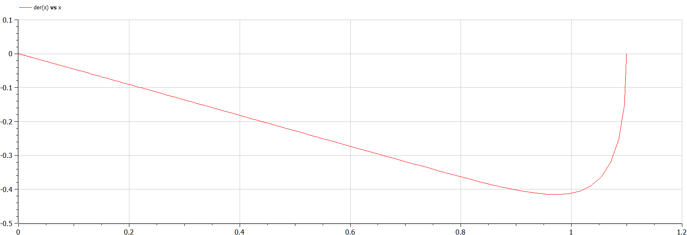
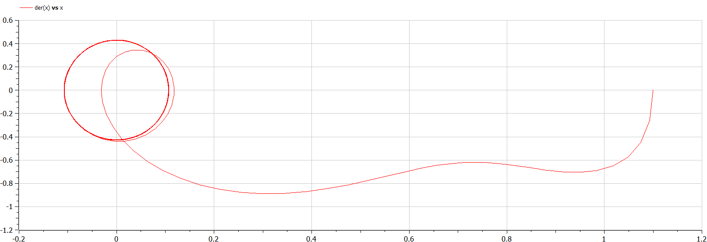

---
# Front matter
lang: ru-RU
title: "Лабораторная работа №4"
subtitle: "Математическое моделирование"
author: "Ильинский Арсений Александрович"

# Formatting
toc-title: "Содержание"
toc: true # Table of contents
toc_depth: 2
lof: true # List of figures
lot: true # List of tables
fontsize: 12pt
linestretch: 1.5
papersize: a4paper
documentclass: scrreprt
polyglossia-lang: russian
polyglossia-otherlangs: english
mainfont: PT Serif
romanfont: PT Serif
sansfont: PT Sans
monofont: PT Mono
mainfontoptions: Ligatures=TeX
romanfontoptions: Ligatures=TeX
sansfontoptions: Ligatures=TeX,Scale=MatchLowercase
monofontoptions: Scale=MatchLowercase
indent: true
pdf-engine: lualatex
header-includes:
  - \usepackage[russian]{babel}
  - \linepenalty=10 # the penalty added to the badness of each line within a paragraph (no associated penalty node) Increasing the value makes tex try to have fewer lines in the paragraph.
  - \interlinepenalty=0 # value of the penalty (node) added after each line of a paragraph.
  - \hyphenpenalty=50 # the penalty for line breaking at an automatically inserted hyphen
  - \exhyphenpenalty=50 # the penalty for line breaking at an explicit hyphen
  - \binoppenalty=700 # the penalty for breaking a line at a binary operator
  - \relpenalty=500 # the penalty for breaking a line at a relation
  - \clubpenalty=150 # extra penalty for breaking after first line of a paragraph
  - \widowpenalty=150 # extra penalty for breaking before last line of a paragraph
  - \displaywidowpenalty=50 # extra penalty for breaking before last line before a display math
  - \brokenpenalty=100 # extra penalty for page breaking after a hyphenated line
  - \predisplaypenalty=10000 # penalty for breaking before a display
  - \postdisplaypenalty=0 # penalty for breaking after a display
  - \floatingpenalty = 20000 # penalty for splitting an insertion (can only be split footnote in standard LaTeX)
  - \raggedbottom # or \flushbottom
  - \usepackage{float} # keep figures where there are in the text
  - \floatplacement{figure}{H} # keep figures where there are in the text
---

# Цель работы

Провести моделирование гармонических колебаний, также известных как линейный гармонический осциллятор. Построить модели и визуализировать фазовый портрет.

# Задание

**Вариант 46**

Постройте фазовый портрет гармонического осциллятора и решение уравнения гармонического осциллятора для следующих случаев:

1. Колебания гармонического осциллятора без затуханий и без действий внешней силы:

   $\ddot{x}+8.8x=0$
   
2. Колебания гармонического осциллятора c затуханием и без действий внешней силы:

   $\ddot{x}+7.7\dot{x}+3.3x=0$
   
3. Колебания гармонического осциллятора c затуханием и под действием внешней силы:

   $\ddot{x}+4.4\dot{x}+5.5x=2sin(6t)$
   

На интервале $t\in[0;55]$ (шаг $0.05$) с начальными условиями $x_0=1.1, y_0=0$.

# Теоретическое введение

Движение грузика на пружинке, маятника, заряда в электрическом контуре, а также эволюция во времени многих систем в физике, химии, биологии и других науках при определенных предположениях можно описать одним и тем же дифференциальным уравнением, которое в теории колебаний выступает в качестве основной модели. Эта модель называется линейным гармоническим осциллятором. Уравнение свободных колебаний гармонического осциллятора имеет следующий вид:

$$\ddot{x}+2\gamma\dot{x}+\omega_0^2x=f(t)\;\;\;\;(1)$$     

- $x$ — переменная, описывающая состояние системы (смещение грузика, заряд
  конденсатора и т.д.)

- $\omega_0$ — собственная частота колебаний.

- $\gamma$ — параметр, характеризующий потери энергии (затухание).

- $t$ — время.

*Пояснение*: $\ddot{x} = \frac{\partial^2 x}{\partial t^2}, \dot{x} = \frac{\partial x}{\partial t}$ — первая и вторая производные по времени.

При отсутствии потерь в системе получаем уравнение консервативного осциллятора, энергия колебания которого сохраняется во времени:

$$ \ddot{x}+\omega_0^2x=0\;\;\;(2)$$ 

Для однозначной разрешимости уравнения второго порядка необходимо задать два начальных условия вида:

$$ \begin{cases} x(t_0) = x_0 \\ \dot{x}(t_0) = y_0 \end{cases} $$

Уравнение второго порядка $(2)$ можно представить в виде системы двух уравнений первого порядка:

$$\begin{cases}\dot{x}=y \\ \dot{y}=-\omega_0^2x \end{cases} $$

Для уравнения $$\ddot{x}+2\gamma\dot{x}+\omega_0^2x=0$$ система примет следующий вид:

$$\begin{cases} \dot{x}=y \\ \dot{y}=-2\gamma\dot{x}-\omega_0^2x \end{cases} $$

Для уравнения $$\ddot{x}+2\gamma\dot{x}+\omega_0^2x=f(t)$$ система примет следующий вид:

$$\begin{cases} \dot{x}=y \\ \dot{y}=-2\gamma\dot{x}-\omega_0^2x+f(t) \end{cases} $$

Начальные условия для системы примут вид:

$$\begin{cases}x(t_0)=x_0 \\ y(t_0)=y_0 \end{cases} $$

Независимые переменные $x$, $y$ определяют пространство, в котором «движется» решение. Это фазовое пространство системы, поскольку оно двумерно будем называть его фазовой плоскостью.

Значение фазовых координат $x$, $y$ в любой момент времени полностью определяет состояние системы. Решению уравнения движения как функции времени отвечает гладкая кривая в фазовой плоскости. Она называется фазовой траекторией. Если множество различных решений (соответствующих различным начальным условиям) изобразить на одной фазовой плоскости, возникает общая картина поведения системы. Такую картину, образованную набором фазовых траекторий, называют фазовым портретом.

# Выполнение лабораторной работы

## 1. Построение модели

Представляем уравнение второго порядка в виде системы двух уравнений первого порядка:

1. Уравнение $\ddot{x}+8.8x=0$ приводится к системе вида: 

   $\begin{cases} \dot{x}=y \\ \dot{y} = -8.8x \end{cases}$
   
2. Уравнение $\ddot{x}+7.7\dot{x}+3.3x=0$ приводится к системе вида: 

   $\begin{cases} \dot{x}=y \\ \dot{y}=-7.7y-3.3x \end{cases}$
   
3. Уравнение $\ddot{x}+4.4\dot{x}+5.5x=2sin(6t)$ приводится к системе вида: 

   $\begin{cases} \dot{x}=y \\ \dot{y}=-4.4y-5.5x+2.2sin(4t)\end{cases}$

## 2. Построение графиков фазового портрета

### 2.1. Колебания гармонического осциллятора без затуханий и без действий внешней силы

1. Код программы с комментариями:
   ```matlab
   // Колебания гармонического осциллятора без затуханий 
   // и без действий внешней силы
   
   model lab4_1
     constant Real w=sqrt(8.8); // собственная частота колебаний
     
     Real x; // фазовая координата
     Real y; // фазовая координата
     
   initial equation
     x=1.1; // начальное значение x(t0)=x0=1.1
     y=0; // начальное значение y(t0)=y0=0
   
   equation
   // система дифференциальных уравнений 1-го порядка
     der(x)=y;
     der(y)=-w*w*x;
   
   end lab4_1;
   ```
   
2. График фазового портрета системы (рис. [-@fig:001]):

   {#fig:001 width=70%}
   
   *Пояснение*: Фазовый портрет гармонического осциллятора без затуханий, без действия внешней силы, с собственной частотой колебания $\omega=\sqrt{8.8}$  по горизонтальной оси значения $x$, по вертикальной оси значения $\dot{x}$ (скорость).

### 2.2. Колебания гармонического осциллятора c затуханием и без действий внешней силы

1. Код программы с комментариями:

   ```matlab
   // Колебания гармонического осциллятора c затуханием
   // и без действий внешней силы
   
   model lab4_2
     constant Real g=(7.7/2); // затухание
     constant Real w=sqrt(3.3); // собственная частота колебаний
     
     Real x; // фазовая координата
     Real y; // фазовая координата
     
   initial equation
     x=1.1; // начальное значение x(t0)=x0=1.1
     y=0; // начальное значение y(t0)=y0=0
   
   equation
   // система дифференциальных уравнений 1-го порядка
     der(x)=y;
     der(y)=-2*g*y-w*w*x;
   
   end lab4_2;
   ```

2. График фазового портрета системы (рис. [-@fig:002]):

   {#fig:002 width=70%}
   
   *Пояснение*: Фазовый портрет гармонического осциллятора с затуханием $\gamma=\frac{7.7}{2}$, без действия внешней силы, с собственной частотой колебания $\omega=\sqrt{3.3}$ по горизонтальной оси значения $x$, по вертикальной оси значения $\dot{x}$ (скорость).

### 2.3. Колебания гармонического осциллятора c затуханием и под действием внешней силы

1. Код программы с комментариями:

   ```matlab
   // Колебания гармонического осциллятора c затуханием 
   // и под действием внешней силы
   
   model lab4_3
     constant Real g=(4.4/2); // затухание
     constant Real w=sqrt(5.5); // собственная частота колебаний
     
     Real x; // фазовая координата
     Real y; // фазовая координата
     Real f; // функция, описывающая внешнюю силу
     
   initial equation
     x=1.1; // начальное значение x(t0)=x0=1.1
     y=0; // начальное значение x(t0)=x0=1.1
     f=0; // начальное значение f(t0)=2.2*sin(4*0)=0;
   
   equation
   // задание функции, описывающую внешнюю силу
     f=2.2*sin(4*time); 
   // система дифференциальных уравнений 1-го порядка
     der(x)=y;
     der(y)=-2*g*y-w*w*x+f;
   
   end lab4_3;
   ```

2. График фазового портрета системы (рис. [-@fig:003]):

   {#fig:003 width=70%}
   
   *Пояснение*: Фазовый портрет гармонического осциллятора с затуханием $\gamma=\frac{4.4}{2}$, с функцией действия внешней силы $f(t)=2.2sin(4t)$, с собственной частотой колебания $\omega=\sqrt{5.5}$ по горизонтальной оси значения $x$, по вертикальной оси значения $\dot{x}$ (скорость).

# Выводы

Благодаря данной лабораторной работе познакомился с моделью гармонических колебаний, а именно научился:

- строить модель для следующих трех случаев:
  - Колебания гармонического осциллятора без затуханий и без действий внешней силы.
  - Колебания гармонического осциллятора c затуханием и без действий внешней силы.
  - Колебания гармонического осциллятора c затуханием и под действием внешней силы.
- строить фазовые портреты вышеперечисленных систем.

# Контрольные вопросы

1. Запишите простейшую модель гармонических колебаний:

   $x=x_mcos(\omega t+\phi_0)$

2. Дайте определение осциллятора:

   Осциллятор — система, совершающая колебания, то есть показатели которой периодически повторяются во времени. 

3. Запишите модель математического маятника:

   Уравнение динамики принимает вид:

   $\frac{d^2 \alpha}{d t^2}+\frac{g}{L}sin{\alpha}=0$

   В случае малых колебаний полагают $sin{\alpha}≈\alpha$. В результате возникает линейное дифференциальное уравнение:

   $\frac{d^2 \alpha}{d t^2}+\frac{g}{L}\alpha=0$

   или

   $\frac{d^2 \alpha}{d t^2}+\omega^2\alpha=0$

4. Запишите алгоритм перехода от дифференциального уравнения второго порядка к двум дифференциальным уравнениям первого порядка:

   Пусть у нас есть дифференциальное уравнение 2-го порядка:

   $\ddot{x}+\omega_0^2x=f(t)$

   Для перехода к системе уравнений 1-го порядка сделаем замену (метод Ранге-Кутты):

   $y=\dot{x}$

   Таким образом, получим систему уравнений:

   $\begin{cases} y= \dot{x} \\ \dot{y}=-\omega_0^2x \end{cases}$

5. Что такое фазовый портрет и фазовая траектория?

   - Фазовая траектория — кривая в фазовом пространстве, составленная из точек, представляющих состояние динамической системы в последовательные моменты времени в течение всего времени эволюции.

   - Фазовый портрет — это геометрическое представление траекторий динамической системы в фазовой плоскости.

     *Иными словами*: картина, образованная набором фазовых траекторий.

# Список литературы

- <code>[Кулябов Д.С. *Лабораторная работа №4*](https://esystem.rudn.ru/mod/resource/view.php?id=831041)</code>
- <code>[Кулябов Д.С. *Задания к лабораторной работе №4 ( по вариантам )*](https://esystem.rudn.ru/mod/resource/view.php?id=831042)</code>