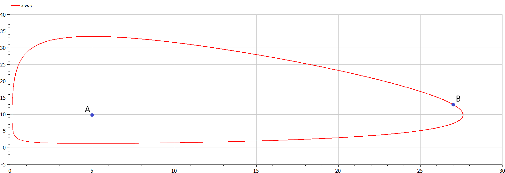
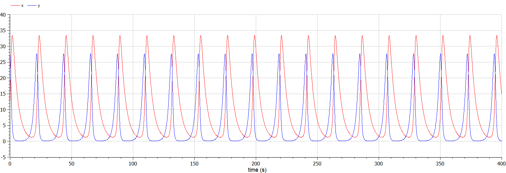

<style>
table {
    border-collapse: collapse;
    border-spacing: 0;
    border: none;
}
th {
    font-size: 25px;
}
td {
    font-size: 25px;
}
img[alt="center"] {
    display: block;
    margin: 0 auto;
}
h1 {
    font-size: 60px;
    text-align: center;
}
h2 {
    font-size: 30px;
    text-align: left;
    position: relative;
    left: -2em;
    line-height: 0px;
    top: 8em;
}
h3 {
    font-size: 40px;
    text-align: left;
    position: relative;
    left: -0em;
    bottom: 0.2em;
}
h4 {
    text-align: center;
    position: relative;
    bottom: 1.2em;
}
h5 {
    font-size: 20px;
    text-align: center;
    position: relative;
    bottom: 3em;
}
</style>

# Лабораторная работа №5
## Ilyinsky A. Arseniy 
## RUDN University, 2022 Moscow, Russia

---

# Прагматика выполнения лабораторной работы

---

### Прагматика выполнения лабораторной работы:
- Знакомство с простейшей моделью взаимодействия двух видов типа «хищник — жертва» — **модель Лотки-Вольтерры**.
- Визуализация результатов моделирования путем построения фазовых портретов и графиков.

---

# Цель лабораторной работы

---

### Цель лабораторной работы:
- Познакомиться с простейшей моделью взаимодействия двух видов типа «хищник — жертва» — **модель Лотки-Вольтерры**, а именно:
    - научиться строить модели двувидового взаимодействия.
    - научиться решать систему дифференциальных уравнений и строить фазовые портреты и графики.

---

# Задание лабораторной работы

---

### Задание лабораторной работы:
Для модели «хищник-жертва»:

$\begin{cases} \frac{dx}{dt} = -0.25x(t) + 0.05x(t)y(t) \\ \frac{dy}{dt} = 0.6y(t) - 0.061x(t)y(t) \end{cases}$

Постройте график зависимости численности хищников от численности жертв, а также графики изменения численности хищников и численности жертв при следующих начальных условиях: $x_0 = 13, y_0 = 27$. Найдите стационарное состояние системы.

---

# Результаты выполнения лабораторной работы

---

### 1. Программная часть

```matlab
model lab5
  constant Real a = 0.25; // естественное вымирание хищников,
  // лишенных пищи в виде жертв
  constant Real b = 0.05; // увеличение популяции хищников 
  // при каждом акте взаимодействия 
  
  constant Real c = 0.6; // скорость естественного прироста
  // числа жертв в отсутствии хищников
  constant Real d = 0.061; // уменьшение популяции жертв
  // при каждом акте взаимодействия.
  
  Real x; // число хищников
  Real y; // число жертв

initial equation
  x = 13; // начальное значение x
  y = 27; // начальное значение y

equation
// система дифференциальных уравнений 1-го порядка
  der(x)=-a*x+b*x*y;
  der(y)=c*y-d*x*y;

end lab5;
```
    
---

### 2. Поиск стационарного состояния система
Стационарное состояние системы (положение равновесия, не зависящее от времени решение) будет в точке:

$$x_0=\frac{c}{d}=\frac{0.6}{0.061}=9.83606557$$
$$y_0=\frac{a}{b}=\frac{0.25}{0.05}=5$$

---

### 3. Построение графиков модели

- График изменения численности хищников от изменения численности жертв:

#### 
##### Рис.1 Фазовый портрет

---

- График изменения численности хищников и численности жертв от времени:

#### 
##### Рис.2 График изменения численности хищников и численности жертв

---

# Спасибо за внимание