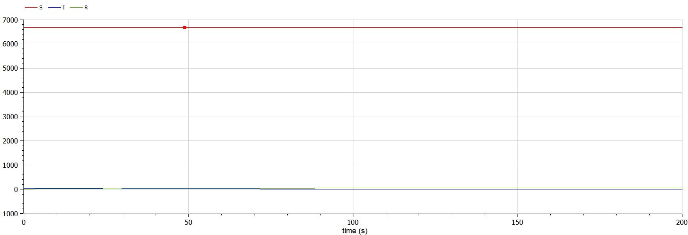
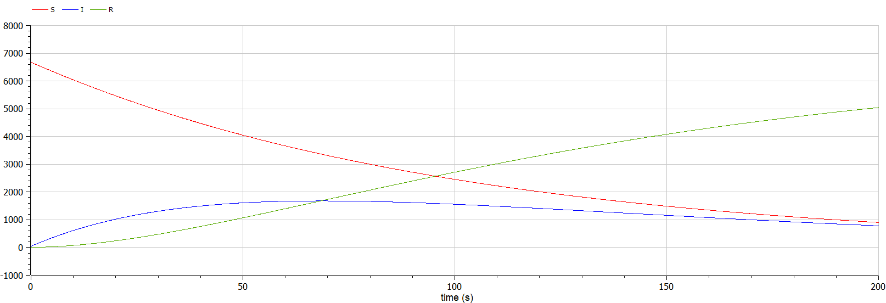

<style>
table {
    border-collapse: collapse;
    border-spacing: 0;
    border: none;
}
th {
    font-size: 25px;
}
td {
    font-size: 25px;
}
img[alt="center"] {
    display: block;
    margin: 0 auto;
}
h1 {
    font-size: 60px;
    text-align: center;
}
h2 {
    font-size: 30px;
    text-align: left;
    position: relative;
    left: -2em;
    line-height: 0px;
    top: 8em;
}
h3 {
    font-size: 40px;
    text-align: left;
    position: relative;
    left: -0em;
    bottom: 0.2em;
}
h4 {
    text-align: center;
    position: relative;
    bottom: 1.2em;
}
h5 {
    font-size: 20px;
    text-align: center;
    position: relative;
    bottom: 3em;
}
</style>

# Лабораторная работа №6
## Ilyinsky A. Arseniy 
## RUDN University, 2022 Moscow, Russia

---

# Прагматика выполнения лабораторной работы

---

### Прагматика выполнения лабораторной работы:
- Знакомство с простейшей **моделью эпидемии**.
- Визуализация результатов моделирования путем построения и анализа графиков.

---

# Цель лабораторной работы

---

### Цель лабораторной работы:
- Познакомиться с простейшей **моделью эпидемии**, а именно:
    - научиться строить модель эпидемии.
    - научиться визуализировать график изменения числа особей.

---

# Задание лабораторной работы

---

### Задание лабораторной работы:
Постройте графики изменения числа особей в каждой из трех групп. Рассмотрите, как будет протекать эпидемия в случае:
1. если $I(0) \leq I^*$.
2. если $I(0) > I^*$.

Условия:
- $N=6730$
- $I(0)=46$
- $R(0)=8$
- $S(0)=N-I(0)-R(0)=6676$
- $\alpha=0.01$, $\beta=0.02$

---

# Результаты выполнения лабораторной работы

---

### 1. Постановка задачи
Популяция подразделяется на три группы: 
- $S(t)$. 
- $I(t)$.
- $R(t)$.

До того, как число заболевших не превышает критического значения $I^*$, считаем, что все больные изолированы и не заражают здоровых. 
Когда $I(t)>I^*$, тогда инфицирование способны заражать восприимчивых к болезни особей. 

---

Скорость изменения числа особей для групп задается следующим образом:
- скорость изменения числа $S(t)$ меняется по следующему закону:
$$
\frac{ds}{dt} = 
	\begin{cases} 
		-\alpha S, \text{ если } I(t)>I^* \\ 
		0,  \text{ если } I(t) \leq I^*
	\end{cases}
$$
- скорость изменения числа $I(t)$ меняется по следующему закону: 
$$
\frac{dI}{dt} = 
	\begin{cases} 
		-\alpha S - \beta I, \text{ если } I(t)>I^* \\ 
		-\beta I,  \text{ если } I(t) \leq I^*
	\end{cases}
$$
- скорость изменения числа $R(t)$ меняется по следующему закону: 
$$
\frac{dR}{dt} = \beta I
$$
---

### 2. Программная часть
- Случай: больные особи изолированы и не заражают здоровых ( $I(0) \leq I^*$ ):

```matlab
model lab6_1
  constant Real a = 0.01;
  constant Real b = 0.02; 
  constant Real N = 6730; 
  Real S; 
  Real I; 
  Real R;

initial equation
  S = N-I-R; 
  I = 46; 
  R = 8; 

equation
  der(S)=0; 
  der(I)=-b*I; 
  der(R)=b*I;

end lab6_1;
```
    
---

- Случай: инфицированные способны заражать восприимчивых к болезни особей ( $I(0) > I^*$ )

```matlab
model lab6_2
  constant Real a = 0.01; 
  constant Real b = 0.02; 
  constant Real N = 6730; 
  Real S; 
  Real I; 
  Real R; 

initial equation
  S = N-I-R; 
  I = 46; 
  R = 8; 

equation
  der(S)=-a*S; 
  der(I)=a*S-b*I; 
  der(R)=b*I;
  
end lab6_2;
```

---

### 3. Построение графиков модели

- График изменения числа людей в каждой из трех групп в случае $I(0) \leq I^*$:

#### 
##### Рис. 1: Динамика изменения числа людей в каждой из трех групп

---

- График изменения числа людей в каждой из трех групп в случае $I(0) > I^*$:

#### 
##### Рис. 2: Динамика изменения числа людей в каждой из трех групп

---

# Спасибо за внимание