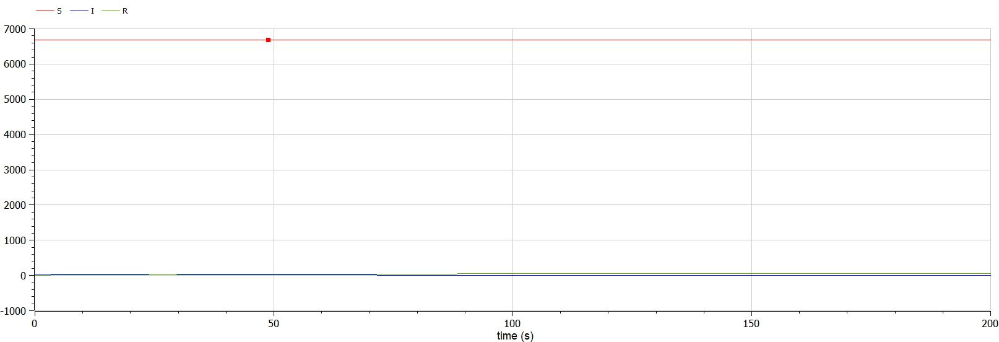
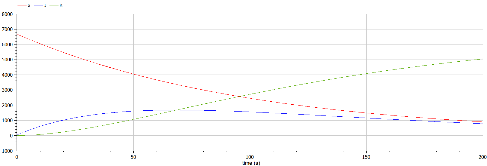

---
# Front matter
lang: ru-RU
title: "Лабораторная работа №6"
subtitle: "Математическое моделирование"
author: "Ильинский Арсений Александрович"

# Formatting
toc-title: "Содержание"
toc: true # Table of contents
toc_depth: 2
lof: true # List of figures
lot: true # List of tables
fontsize: 12pt
linestretch: 1.5
papersize: a4paper
documentclass: scrreprt
polyglossia-lang: russian
polyglossia-otherlangs: english
mainfont: PT Serif
romanfont: PT Serif
sansfont: PT Sans
monofont: PT Mono
mainfontoptions: Ligatures=TeX
romanfontoptions: Ligatures=TeX
sansfontoptions: Ligatures=TeX,Scale=MatchLowercase
monofontoptions: Scale=MatchLowercase
indent: true
pdf-engine: lualatex
header-includes:
  - \usepackage[russian]{babel}
  - \linepenalty=10 # the penalty added to the badness of each line within a paragraph (no associated penalty node) Increasing the value makes tex try to have fewer lines in the paragraph.
  - \interlinepenalty=0 # value of the penalty (node) added after each line of a paragraph.
  - \hyphenpenalty=50 # the penalty for line breaking at an automatically inserted hyphen
  - \exhyphenpenalty=50 # the penalty for line breaking at an explicit hyphen
  - \binoppenalty=700 # the penalty for breaking a line at a binary operator
  - \relpenalty=500 # the penalty for breaking a line at a relation
  - \clubpenalty=150 # extra penalty for breaking after first line of a paragraph
  - \widowpenalty=150 # extra penalty for breaking before last line of a paragraph
  - \displaywidowpenalty=50 # extra penalty for breaking before last line before a display math
  - \brokenpenalty=100 # extra penalty for page breaking after a hyphenated line
  - \predisplaypenalty=10000 # penalty for breaking before a display
  - \postdisplaypenalty=0 # penalty for breaking after a display
  - \floatingpenalty = 20000 # penalty for splitting an insertion (can only be split footnote in standard LaTeX)
  - \raggedbottom # or \flushbottom
  - \usepackage{float} # keep figures where there are in the text
  - \floatplacement{figure}{H} # keep figures where there are in the text
---

# Цель работы

Рассмотреть простейшую **модель эпидемии**. Построить модель и визуализировать график изменения числа особей.

# Задание

**Вариант 46**

На одном острове вспыхнула эпидемия. Известно, что из всех проживающих на острове $(N=6 730)$ в момент начала эпидемии $(t=0)$ число заболевших людей (являющихся распространителями инфекции) $I(0)=46$, А число здоровых людей с иммунитетом к болезни $R(0)=8$. Таким образом, число людей восприимчивых к болезни, но пока здоровых, в начальный момент времени $S(0)=N-I(0)- R(0)$.

Постройте графики изменения числа особей в каждой из трех групп. Рассмотрите, как будет протекать эпидемия в случае: 

1. если $I(0) \leq I^*$.
2. если $I(0)>I^*$. 

# Теоретическое введение

Предположим, что некая популяция, состоящая из $N$ особей, (считаем, что популяция изолирована) подразделяется на три группы:

- **Первая группа** — это восприимчивые к болезни, но пока здоровые особи, обозначим их через $S(t)$. 
- **Вторая группа** — это число инфицированных особей, которые также при этом являются распространителями инфекции, обозначим их $I(t)$. 
- **Третья группа** — это здоровые особи с иммунитетом к болезни, обозначим их $R(t)$. 

До того, как число заболевших не превышает критического значения $I^*$, считаем, что все больные изолированы и не заражают здоровых. Когда $I(t)>I^*$, тогда инфицирование способны заражать восприимчивых к болезни особей. 

Таким образом, скорость изменения числа $S(t)$ меняется по следующему закону:
$$
\frac{ds}{dt} = 
	\begin{cases} 
		-\alpha S, \text{ если } I(t)>I^* \\ 
		0,  \text{ если } I(t) \leq I^*
	\end{cases}
\;\;\;\;(1)
$$

Поскольку каждая восприимчивая к болезни особь, которая, в конце концов, заболевает, сама становится инфекционной, то скорость изменения числа инфекционных особей представляет разность за единицу времени между заразившимися и теми, кто уже болеет и лечится, т.е.:
$$
\frac{dI}{dt} = 
	\begin{cases} 
		-\alpha S - \beta I, \text{ если } I(t)>I^* \\ 
		-\beta I,  \text{ если } I(t) \leq I^*
	\end{cases}
\;\;\;\;(2)
$$

А скорость изменения выздоравливающих особей (при этом приобретающие иммунитет к болезни)
$$
\frac{dR}{dt} = \beta I
\;\;\;\;(3)
$$

Постоянные пропорциональности $\alpha$, $\beta$ - это коэффициенты заболеваемости и выздоровления соответственно.

Для того, чтобы решения соответствующих уравнений определялось однозначно, необходимо задать начальные условия. Считаем, что на начало эпидемии в момент времени $t=0$ нет особей с иммунитетом к болезни $R(0)=0$, а число инфицированных и восприимчивых к болезни особей $I(0)$ и $S(0)$ соответственно. 

Для анализа картины протекания эпидемии необходимо рассмотреть два случая:

- $I(0) \leq I^*$.
- $I(0) > I^*$.


# Выполнение лабораторной работы

## 1. Моделирование и построение графиков

### 1.1.  Случай: больные особи изолированы и не заражают здоровых

1. Условие:

   $I(0) \leq I^*$

   В этом случае значения $S(t)$, $I(t)$, $R(t)$ изменяются по следующим законам:

   - Из $(1)$:

     $\frac{dS}{dt} = 0$

   - Из $(2)$:

     $\frac{dI}{dt} = - \beta * I$

   - Из $(3)$:

     $\frac{dR}{dt} = \beta * I$

2. Код программы с комментариями:

   ```matlab
   // Задача об эпидемии
   // 1-ый случай: все больные изолированы и не заражают
                // здоровых
   
   model lab6_1
     constant Real a = 0.01; // коэффициент заболеваемости
     constant Real b = 0.02; // коэффициент выздоровления
     constant Real N = 6730; // количество особей
     
     Real S; // 1ая группа - восприимчивые к болезни, но
             // пока здоровые особи
     Real I; // 2ая группа - число инфицированных особей,
             // которые также при этом являются
             // распространителями инфекции
     Real R; // 3ая группа - это здоровые особи с иммунитетом
             // к болезни
   
   initial equation
     S = N-I-R; // начальное значение S(0)
     I = 46; // начальное значение I(0)
     R = 8; // начальное значение R(0)
   
   equation
     der(S)=0; // скорость изменения числа S(t)
     der(I)=-b*I; // скорость изменения числа I(t)
     der(R)=b*I; // скорость изменения числа R(t)
   
   end lab6_1;
   ```

3. График изменения числа людей в каждой из трех групп (рис. [-@fig:001]):

   {#fig:1 width=70%}
   
   *Пояснение*: динамика изменения числа людей в каждой из трех групп в случае, когда $I(0) \leq I^*$, с начальными условиями $S(0) = N - I - R = 6676$, $I(0) = 46$, $R(0)=8$  и коэффициентами $\alpha = 0.01$, $\beta = 0.02$, — по горизонтальной оси значения $t$ (времени), по вертикальной $S(t)$, $I(t)$, $R(t)$, где:

   - <span style="color:red">красный</span> — первая группа $S(t)$, т.е. восприимчивые к болезни, но пока здоровые особи.
   - <span style="color:blue">синий</span> — вторая группа $I(t)$, т.е. инфицированные особи, которые также при этом являются распространителями инфекции.
   - <span style="color:green">зеленый</span> — третья группа $R(t)$, т.е. здоровые особи с иммунитетом к болезни.
   
### 1.2.  Случай: инфицированные способны заражать восприимчивых к болезни особей    

1. Условие:

   $I(0) > I^*$

   В этом случае значения $S(t)$, $I(t)$, $R(t)$ изменяются по следующим законам:

   - Из $(1)$:

     $\frac{dS}{dt} = - \alpha * S$

   - Из $(2)$:

     $\frac{dI}{dt} = \alpha * S - \beta * I$

   - Из $(3)$:

     $\frac{dR}{dt} = \beta * I$

2. Код программы с комментариями:

   ```matlab
   // Задача об эпидемии
   // 2-ой случай: инфицирование способны заражать восприимчивых
                 //к болезни особей
   
   model lab6_2
     constant Real a = 0.01; // коэффициент заболеваемости
     constant Real b = 0.02; // коэффициент выздоровления
     constant Real N = 6730; // количество особей
     
     Real S; // 1ая группа - восприимчивые к болезни, но
             // пока здоровые особи
     Real I; // 2ая группа - число инфицированных особей,
             // которые также при этом являются
             // распространителями инфекции
     Real R; // 3ая группа - это здоровые особи с иммунитетом
             // к болезни
   
   initial equation
     S = N-I-R; // начальное значение S(0)
     I = 46; // начальное значение I(0)
     R = 8; // начальное значение R(0)
   
   equation
     der(S)=-a*S; // скорость изменения числа S(t)
     der(I)=a*S-b*I; // скорость изменения числа I(t)
     der(R)=b*I; // скорость изменения числа R(t)
     
   end lab6_2;
   ```

3. График изменения числа людей в каждой из трех групп (рис. [-@fig:002]):

   {#fig:2 width=70%}

   *Пояснение*: динамика изменения числа людей в каждой из трех групп в случае, когда $I(0) > I^*$, с начальными условиями $S(0) = N - I - R = 6676$, $I(0) = 46$, $R(0)=8$ и коэффициентами $\alpha = 0.01$, $\beta = 0.02$, — по горизонтальной оси значения $t$ (времени), по вертикальной $S(t)$, $I(t)$, $R(t)$, где:

   - <span style="color:red">красный</span> — первая группа $S(t)$, т.е. восприимчивые к болезни, но пока здоровые особи.
   - <span style="color:blue">синий</span> — вторая группа $I(t)$, т.е. инфицированные особи, которые также при этом являются распространителями инфекции.
   - <span style="color:green">зеленый</span> — третья группа $R(t)$, т.е. здоровые особи с иммунитетом к болезни.

# Выводы

Благодаря данной лабораторной работе познакомился с простейшей **моделью эпидемии**, а именно научился:

- строить модель.
- строить график изменения числа особей.


# Список литературы

- <code>[Кулябов Д.С. *Лабораторная работа №6*](https://esystem.rudn.ru/mod/resource/view.php?id=831049)</code>
- <code>[Кулябов Д.С. *Задания к лабораторной работе №6 ( по вариантам )*](https://esystem.rudn.ru/mod/resource/view.php?id=831050)</code>

