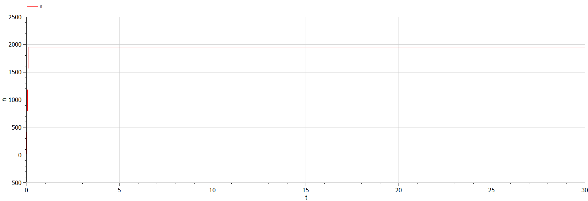

<style>
table {
    border-collapse: collapse;
    border-spacing: 0;
    border: none;
}
th {
    font-size: 25px;
}
td {
    font-size: 25px;
}
img[alt="center"] {
    display: block;
    margin: 0 auto;
}
h1 {
    font-size: 60px;
    text-align: center;
}
h2 {
    font-size: 30px;
    text-align: left;
    position: relative;
    left: -2em;
    line-height: 0px;
    top: 8em;
}
h3 {
    font-size: 40px;
    text-align: left;
    position: relative;
    left: -0em;
    bottom: 0.2em;
}
h4 {
    text-align: center;
    position: relative;
    bottom: 1.2em;
}
h5 {
    font-size: 20px;
    text-align: center;
    position: relative;
    bottom: 3em;
}
</style>

# Лабораторная работа №7
## Ilyinsky A. Arseniy 
## RUDN University, 2022 Moscow, Russia

---

# Прагматика выполнения лабораторной работы

---

### Прагматика выполнения лабораторной работы:
- Знакомство с простейшей **моделью «эффективность рекламы»**.
- Визуализация результатов моделирования путем построения и анализа графиков.

---

# Цель лабораторной работы

---

### Цель лабораторной работы:
- Научиться строить модели эффективности рекламы для трех случаев:
    - при высокой эффективности платной рекламы.
    - при высокой эффективности сарафанного радио.
    - при равных эффективностях рекламы и сарафанного радио.
- Научиться решать дифференциальное уравнение и строить графики эффективности распространения рекламы.


---

# Задание лабораторной работы

---

### Задание лабораторной работы:
Постройте график распространения рекламы, математическая модель которой описывается следующим уравнением:
1. $\frac{dn}{dt} = (0.444+0.000055n(t))(N-n(t))$
2. $\frac{dn}{dt} = (0.000065+0.433n(t))(N-n(t))$
3. $\frac{dn}{dt} = (0.5cos(12t)+0.3cos(13t)n(t))(N-n(t))$

При этом объем аудитории $N = 1950$, в начальный момент о товаре знает $25$ человек. Для случая $2$ определите в какой момент времени скорость распространения рекламы будет иметь максимальное значение.

---

# Результаты выполнения лабораторной работы

---

### 1. Программная часть
- Случай: при высокой эффективности платной рекламы ($\alpha_1(t) \gg \alpha_2(t)$):

```matlab
model lab7_1
  constant Real N = 1950; // общее число потенциальных
                          // платежеспособных покупателей
  
  Real a1; // интенсивность рекламной компании, зависящая
           // от затрат
  Real a2; // интенсивность рекламной компании, зависящая
           // от сарафанного радио
  Real n; // число информированных клиентов
  
initial equation
  a1 = 0.444; // начальное значение a1(0)
  a2 = 0.000055; // начальное значение a2(0)
  n = 25; // начальное значение n(0)
  
equation
  a1 = 0.444; // задание функции a1(t)
  a2 = 0.000055; // задание функции a2(t)
  der(n) = (a1+a2*n)*(N-n); // скорость изменения со временем 
                            // числа потребителей, узнавших о
                            // товаре и готовых его купить

end lab7_1;
```
    
---

- Случай: при высокой эффективности сарафанного радио ($\alpha_1(t) \ll \alpha_2(t)$):

```matlab
model lab7_2
  constant Real N = 1950; // общее число потенциальных
                          // платежеспособных покупателей
  
  Real a1; // интенсивность рекламной компании, зависящая
           // от затрат
  Real a2; // интенсивность рекламной компании, зависящая
           // от сарафанного радио
  Real n; // число информированных клиентов
  
initial equation
  a1 = 0.000065; // начальное значение a1(0)
  a2 = 0.433; // начальное значение a2(0)
  n = 25; // начальное значение n(0)
  
equation
  a1 = 0.000065; // задание функции a1(t)
  a2 = 0.433; // задание функции a2(t)
  der(n) = (a1+a2*n)*(N-n); // скорость изменения со временем 
                            // числа потребителей, узнавших о
                            // товаре и готовых его купить

end lab7_2;
```

---

- Случай: при равных эффективностях рекламы и сарафанного радио ($\alpha_1(t) \approx \alpha_2(t)$):
```matlab
model lab7_3
  constant Real N = 1950; // общее число потенциальных
                          // платежеспособных покупателей
  
  Real a1; // интенсивность рекламной компании, зависящая
           // от затрат
  Real a2; // интенсивность рекламной компании, зависящая
           // от сарафанного радио
  Real n; // число информированных клиентов
  
initial equation
  a1 = 0.5; // начальное значение a1(0)
  a2 = 0.3; // начальное значение a2(0)
  n = 25; // начальное значение n(0)
  
equation
  a1 = 0.5*cos(12*time); // задание функции a1(t)
  a2 = 0.3*cos(13*time); // задание функции a2(t)
  der(n) = (a1+a2*n)*(N-n); // скорость изменения со временем 
                            // числа потребителей, узнавших о
                            // товаре и готовых его купить

end lab7_3;
```

---

- Сравнение эффективности платной рекламы и сарафанного радио:
```matlab
model lab7_4
  constant Real N = 1950; // общее число потенциальных
                          // платежеспособных покупателей
  
  Real a1; // интенсивность рекламной компании, зависящая
           // от затрат
  Real a2; // интенсивность рекламной компании, зависящая
           // от сарафанного радио
  Real n; // число информированных клиентов
  Real k; // число информированных клиентов
  
initial equation
  a1 = 0.1; // начальное значение a1(0)
  a2 = 0.1; // начальное значение a2(0)
  n = 25; // начальное значение n(0)
  k = 25; // начальное значение k(0)
  
equation
  a1 = 0.1; // задание функции a1(t)
  a2 = 0.1; // задание функции a2(t)
  der(n) = a1*(N-n); // эффективность платной рекламы
  der(k) = a2*k*(N-k); // эффективность сарафанного радио

end lab7_4;
```

---

### 2. Построение графиков эффективности рекламы

- График распространения эффективности рекламы для случая $\alpha_1(t) \gg \alpha_2(t)$:

#### 
##### Рис. 1: График распространения информации о товаре

---

- График распространения эффективности рекламы для случая $\alpha_1(t) \ll \alpha_2(t)$:

#### 
##### Рис. 2: График распространения информации о товаре

---

- График распространения эффективности рекламы для случая $\alpha_1(t) \approx \alpha_2(t)$:
#### 
##### Рис. 3: График распространения информации о товаре

---

- Сравнение эффективности платной рекламы и сарафанного радио:
#### 
##### Рис. 4: Сравнение эффективности

---

# Спасибо за внимание