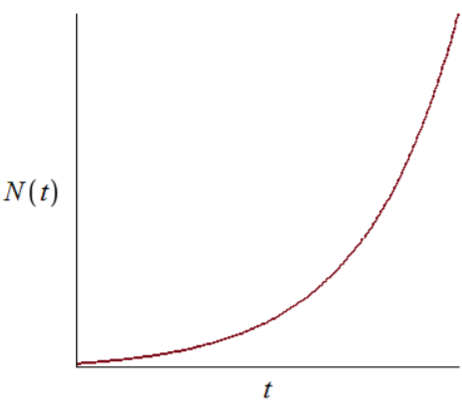
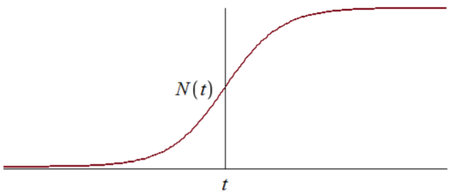
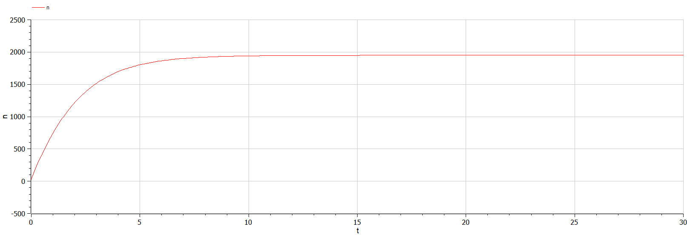
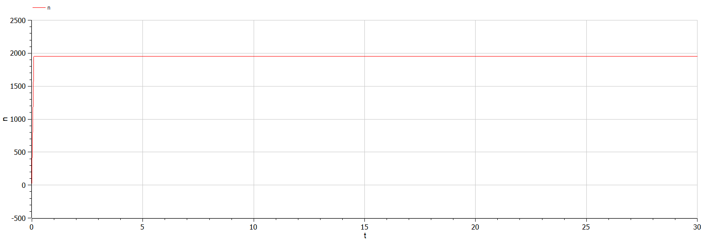
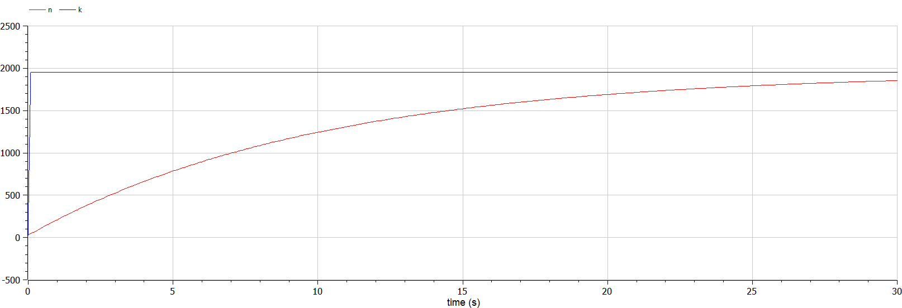

---
# Front matter
lang: ru-RU
title: "Лабораторная работа №7"
subtitle: "Математическое моделирование"
author: "Ильинский Арсений Александрович"

# Formatting
toc-title: "Содержание"
toc: true # Table of contents
toc_depth: 2
lof: true # List of figures
lot: true # List of tables
fontsize: 12pt
linestretch: 1.5
papersize: a4paper
documentclass: scrreprt
polyglossia-lang: russian
polyglossia-otherlangs: english
mainfont: PT Serif
romanfont: PT Serif
sansfont: PT Sans
monofont: PT Mono
mainfontoptions: Ligatures=TeX
romanfontoptions: Ligatures=TeX
sansfontoptions: Ligatures=TeX,Scale=MatchLowercase
monofontoptions: Scale=MatchLowercase
indent: true
pdf-engine: lualatex
header-includes:
  - \usepackage[russian]{babel}
  - \linepenalty=10 # the penalty added to the badness of each line within a paragraph (no associated penalty node) Increasing the value makes tex try to have fewer lines in the paragraph.
  - \interlinepenalty=0 # value of the penalty (node) added after each line of a paragraph.
  - \hyphenpenalty=50 # the penalty for line breaking at an automatically inserted hyphen
  - \exhyphenpenalty=50 # the penalty for line breaking at an explicit hyphen
  - \binoppenalty=700 # the penalty for breaking a line at a binary operator
  - \relpenalty=500 # the penalty for breaking a line at a relation
  - \clubpenalty=150 # extra penalty for breaking after first line of a paragraph
  - \widowpenalty=150 # extra penalty for breaking before last line of a paragraph
  - \displaywidowpenalty=50 # extra penalty for breaking before last line before a display math
  - \brokenpenalty=100 # extra penalty for page breaking after a hyphenated line
  - \predisplaypenalty=10000 # penalty for breaking before a display
  - \postdisplaypenalty=0 # penalty for breaking after a display
  - \floatingpenalty = 20000 # penalty for splitting an insertion (can only be split footnote in standard LaTeX)
  - \raggedbottom # or \flushbottom
  - \usepackage{float} # keep figures where there are in the text
  - \floatplacement{figure}{H} # keep figures where there are in the text
---

# Цель работы

Рассмотреть простейшую **модель «эффективность рекламы»**. Построить модель и визуализировать и анализировать графики эффективности распространения рекламы для трех случаев.

# Задание

**Вариант 46**

$29$ января в городе открылся новый салон красоты. Полагаем, что на момент открытия о салоне знали $N_0$ потенциальных клиентов. По маркетинговым исследованиям известно, что в районе проживают $N$ потенциальных клиентов салона. Поэтому после открытия салона руководитель запускает активную рекламную компанию. После этого скорость изменения числа знающих о салоне пропорциональна как числу знающих о нем, так и числу не знаю о нем. 

Постройте график распространения рекламы, математическая модель которой описывается следующим уравнением:

1. $\frac{dn}{dt} = (0.444+0.000055n(t))(N-n(t))$
2. $\frac{dn}{dt} = (0.000065+0.433n(t))(N-n(t))$
3. $\frac{dn}{dt} = (0.5cos(12t)+0.3cos(13t)n(t))(N-n(t))$

При этом объем аудитории $N = 1950$, в начальный момент о товаре знает $25$ человек. Для случая $2$ определите в какой момент времени скорость распространения рекламы будет иметь максимальное значение.

# Теоретическое введение

Организуется рекламная кампания нового товара или услуги. Необходимо, чтобы прибыль будущих продаж с избытком покрывала издержки на рекламу. Вначале расходы могут превышать прибыль, поскольку лишь малая часть потенциальных покупателей будет информирована о новинке. Затем, при увеличении числа продаж, возрастает и прибыль, и, наконец, наступит момент, когда рынок насытиться, и рекламировать товар станет бесполезным. 

Предположим, что торговыми учреждениями реализуется некоторая продукция, о которой в момент времени $t$ из числа потенциальных покупателей $N$ знает лишь $n$ покупателей. Для ускорения сбыта продукции запускается реклама по радио, телевидению и других средств массовой информации. После запуска рекламной кампании информация о продукции начнет распространяться среди потенциальных покупателей путем общения друг с другом. Таким образом, после запуска рекламных объявлений скорость изменения числа знающих о продукции людей пропорциональна как числу знающих о товаре покупателей, так и числу покупателей о нем не знающих.

Модель рекламной кампании описывается следующими величинами, считаем, что:

- $\frac{dn}{dt}$ — скорость изменения со временем числа потребителей, узнавших о товаре и готовых его купить.

- $t$ — время, прошедшее с начала рекламной кампании.

- $n(t)$ — число уже информированных клиентов. 

  Эта величина пропорциональна числу покупателей, еще не знающих о нем, это описывается следующим образом: 

  $\alpha_1(t)(N-n(t))$ , где: 

  - $N$ — общее число потенциальных платежеспособных покупателей.
  - $\alpha_1(t) > 0$ — характеризует интенсивность рекламной кампании (зависит от затрат на рекламу в данный момент времени). 

  Помимо этого, узнавшие о товаре потребители также распространяют полученную информацию среди потенциальных покупателей, не знающих о нем (в этом случае работает т.н. сарафанное радио). Этот вклад в рекламу описывается величиной:
  
  $\alpha_2(t)n(t)(N-n(t))$ — эта величина увеличивается с увеличением потребителей узнавших о товаре. 
  

Математическая модель распространения рекламы описывается уравнением:
$$
\frac{dn}{dt} = (\alpha_1(t)+\alpha_2(t)*n(t))(N-n(t))\;\;\;\;(1)
$$

- При $\alpha_1(t) \gg \alpha_2(t)$ получается модель типа модели Мальтуса, решение которой имеет вид (рис. [-@fig:001]):

  {#fig:1 width=70%}

- В обратном случае, при $\alpha_1(t) \ll \alpha_2(t)$ получаем уравнение логистической кривой (рис. [-@fig:002]):

  {#fig:2 width=70%}


# Выполнение лабораторной работы

## 1. Моделирование и построение графиков

### 1.1.  Случай: эффективность рекламной компании при $\alpha_1(t) \gg \alpha_2(t)$ 

1. Модель:

   $\frac{dn}{dt} = (0.444+0.000055n(t))(N-n(t))$ , где:

   - $\alpha_1(t) = 0.444$
   - $\alpha_2(t) = 0.000055$
   
2. Код программы с комментариями:

   ```matlab
   // Модель эффективность рекламы
   // случай: эффектиность рекламы при a1>>a2
   
   model lab7_1
     constant Real N = 1950; // общее число потенциальных
                             // платежеспособных покупателей
     
     Real a1; // интенсивность рекламной компании, зависящая
              // от затрат
     Real a2; // интенсивность рекламной компании, зависящая
              // от сарафанного радио
     Real n; // число информированных клиентов
     
   initial equation
     a1 = 0.444; // начальное значение a1(0)
     a2 = 0.000055; // начальное значение a2(0)
     n = 25; // начальное значение n(0)
     
   equation
     a1 = 0.444; // задание функции a1(t)
     a2 = 0.000055; // задание функции a2(t)
     der(n) = (a1+a2*n)*(N-n); // скорость изменения со временем 
                               // числа потребителей, узнавших о
                               // товаре и готовых его купить
   
   end lab7_1;
   ```
   
3. График распространения рекламы (рис. [-@fig:003]):

   {#fig:3 width=70%}
   
   *Пояснение*: график распространения информации о товаре с учетом платной рекламы и с учетом сарафанного радио, — по горизонтальной оси значения $t$ (времени), по вертикальной $n(t)$ (число информированных клиентов), с коэффициентами интенсивности рекламной компании $\alpha_1(t) = 0.444$ и $\alpha_2(t) = 0.000055$.

   
### 1.2.  Случай: эффективность рекламной компании при $\alpha_1(t) \ll \alpha_2(t)$   

1. Модель:

   $\frac{dn}{dt} = (0.000065+0.433n(t))(N-n(t))$ , где:

   - $\alpha_1(t) = 0.000065$
   - $\alpha_2(t) = 0.433$
   
2. Код программы с комментариями:

   ```matlab
   // Модель эффективность рекламы
   // случай: эффектиность рекламы при a1<<a2
   
   model lab7_2
     constant Real N = 1950; // общее число потенциальных
                             // платежеспособных покупателей
     
     Real a1; // интенсивность рекламной компании, зависящая
              // от затрат
     Real a2; // интенсивность рекламной компании, зависящая
              // от сарафанного радио
     Real n; // число информированных клиентов
     
   initial equation
     a1 = 0.000065; // начальное значение a1(0)
     a2 = 0.433; // начальное значение a2(0)
     n = 25; // начальное значение n(0)
     
   equation
     a1 = 0.000065; // задание функции a1(t)
     a2 = 0.433; // задание функции a2(t)
     der(n) = (a1+a2*n)*(N-n); // скорость изменения со временем 
                               // числа потребителей, узнавших о
                               // товаре и готовых его купить
   
   end lab7_2;
   ```
   
3. График распространения рекламы (рис. [-@fig:004]):

   {#fig:4 width=70%}

   *Пояснение*: график распространения информации о товаре с учетом платной рекламы и с учетом сарафанного радио, — по горизонтальной оси значения $t$ (времени), по вертикальной $n(t)$ (число информированных клиентов), с коэффициентами интенсивности рекламной компании $\alpha_1(t) = 0.000065$ и $\alpha_2(t) = 0.433$.
   
4. Поиск момента времени, в который скорость распространения рекламы будет максимальна:

   *Ответ*: в момент времени $t = 0.1$ скорость распространения рекламы $n(t)$ будет иметь максимальное значение, т.е. $n(0.1) = N = 1950$ (где $N$ — общее число потенциальных платежеспособных покупателей).

### 1.3.  Случай: эффективность рекламной компании при $\alpha_1(t) \approx \alpha_2(t)$ 

1. Модель:

   $\frac{dn}{dt} = (0.5cos(12t)+0.3cos(13t)n(t))(N-n(t))$ , где:

   - $\alpha_1(t) = 0.5cos(12t)$
   - $\alpha_2(t) = 0.3cos(13t)$
   
2. Код программы с комментариями:

   ```matlab
   // Модель эффективность рекламы
   // случай: эффектиность рекламы при a1≈a2
   
   model lab7_3
     constant Real N = 1950; // общее число потенциальных
                             // платежеспособных покупателей
     
     Real a1; // интенсивность рекламной компании, зависящая
              // от затрат
     Real a2; // интенсивность рекламной компании, зависящая
              // от сарафанного радио
     Real n; // число информированных клиентов
     
   initial equation
     a1 = 0.5; // начальное значение a1(0)
     a2 = 0.3; // начальное значение a2(0)
     n = 25; // начальное значение n(0)
     
   equation
     a1 = 0.5*cos(12*time); // задание функции a1(t)
     a2 = 0.3*cos(13*time); // задание функции a2(t)
     der(n) = (a1+a2*n)*(N-n); // скорость изменения со временем 
                               // числа потребителей, узнавших о
                               // товаре и готовых его купить
   
   end lab7_3;
   ```
   
3. График распространения рекламы (рис. [-@fig:005]):

   {#fig:5 width=70%}

   *Пояснение*: график распространения информации о товаре с учетом платной рекламы и с учетом сарафанного радио, — по горизонтальной оси значения $t$ (времени), по вертикальной $n(t)$ (число информированных клиентов), с коэффициентами интенсивности рекламной компании $\alpha_1(t) = 0.5cos(12t)$ и $\alpha_2(t) = 0.3cos(13t)$.

### 1.4. Сравнение эффективности платной рекламы и сарафанного радио

1. Модель:

   - эффективность платной рекламы:

     $\frac{dn}{dt} = \alpha_1(t)(N-n(t))$
   
   - эффективность сарафанного радио:
   
     $\frac{dn}{dt} = \alpha_2(t)(N-n(t))$
   
2. Код программы с комментариями:

   ```matlab
   // Модель эффективность рекламы
   // сравнение эффективности платной рекламы и 
   // сарафанного радио
   
   model lab7_4
     constant Real N = 1950; // общее число потенциальных
                             // платежеспособных покупателей
     
     Real a1; // интенсивность рекламной компании, зависящая
              // от затрат
     Real a2; // интенсивность рекламной компании, зависящая
              // от сарафанного радио
     Real n; // число информированных клиентов
     Real k; // число информированных клиентов
     
   initial equation
     a1 = 0.1; // начальное значение a1(0)
     a2 = 0.1; // начальное значение a2(0)
     n = 25; // начальное значение n(0)
     k = 25; // начальное значение k(0)
     
   equation
     a1 = 0.1; // задание функции a1(t)
     a2 = 0.1; // задание функции a2(t)
     der(n) = a1*(N-n); // эффективность платной рекламы
     der(k) = a2*k*(N-k); // эффективность сарафанного радио
   
   end lab7_4;
   ```
   
3. График распространения рекламы (рис. [-@fig:006]):

   {#fig:6 width=70%}

   *Пояснение*: таким образом, мы можем наблюдать, что эффективность сарафанного радио выше (т.е. максимальное значение $N$ (общее число потенциальных платежеспособных покупателей) достигается быстрее), чем эффективность платной рекламы, — по горизонтальной оси значения $t$ (времени), по вертикальной $n(t)$ (число информированных клиентов с учетом вклада только платной рекламы) и $k(t)$ (число информированных клиентов с учетом, что информация о товаре распространятся только путем «сарафанного радио» ), с коэффициентами интенсивности рекламной компании $\alpha_1(t) = 0.1$ и $\alpha_2(t) = 0.1$, где:
   
   - <span style="color:red">красный</span> — значения $n(t)$.
   - <span style="color:blue">синий</span> — значения $k(t)$.

# Выводы

Благодаря данной лабораторной работе познакомился с простейшей **модель «эффективность рекламы»**, а именно научился:

- строить модель.
- строить график распространения рекламы.

И как видно по графикам трех случаев и сравнения эффективности, в данной модели сарафанное радио работает намного лучше, т.к. намного больше людей узнает о продукте именно благодаря ему.

# Контрольные вопросы

1. Записать модель Мальтуса (дать пояснение, где используется данная модель):

   $\frac{\partial N}{\partial t} = rN$, где:

   -  $N$ — исходная численность населения.
   - $r$ — коэффициент пропорциональности, для которого $r = b - d$, где:
     - $b$ — коэффициент рождаемости.
     - $d$ — коэффициент смертности.
   - $t$ — время.

   Модель используется в экологии для расчета изменения популяции особей животных.

2. Записать уравнение логистической кривой (дать пояснение, что описывает данное уравнение):

   $\frac{\partial P}{\partial t} = rP(1 - \frac{P}{K})$, где:

   - $r$ — характеризует скорость роста (размножения).
   - $K$ — поддерживающая ёмкость среды (то есть, максимально возможная численность популяции).

   Исходные предположения для вывода уравнения при рассмотрении популяционной динамики выглядят следующим образом:

   - скорость размножения популяции пропорциональна её текущей численности, при прочих равных условиях.
   - скорость размножения популяции пропорциональна количеству доступных ресурсов, при прочих равных условиях. Таким образом, второй член уравнения отражает конкуренцию за ресурсы, которая ограничивает рост популяции.

3. На что влияет коэффициент $\alpha_1(t)$ и $\alpha_2(t)$ в модели распространения рекламы:

   - $\alpha_1(t)$ — интенсивность рекламной кампании, зависящая от затрат.
   - $\alpha_2(t)$ — интенсивность рекламной кампании, зависящая от сарафанного радио.

4. Как ведет себя рассматриваемая модель при $\alpha_1(t) \gg \alpha_2(t)$:

   При $\alpha_1(t) \gg \alpha_2(t)$ получается модель типа модели Мальтуса (рис. -@fig:007):

   {#fig:7 width=70%}

5. Как ведет себя рассматриваемая модель при $\alpha_1(t) \ll \alpha_2(t)$:

   При $\alpha_1(t) \ll \alpha_2(t)$ получаем уравнение логистической кривой (рис. -@fig:008):

   {#fig:8 width=70%}

# Список литературы

- <code>[Кулябов Д.С. *Лабораторная работа №7*](https://esystem.rudn.ru/mod/resource/view.php?id=831053)</code>
- <code>[Кулябов Д.С. *Задания к лабораторной работе №7 ( по вариантам )*](https://esystem.rudn.ru/mod/resource/view.php?id=831054)</code>

 
