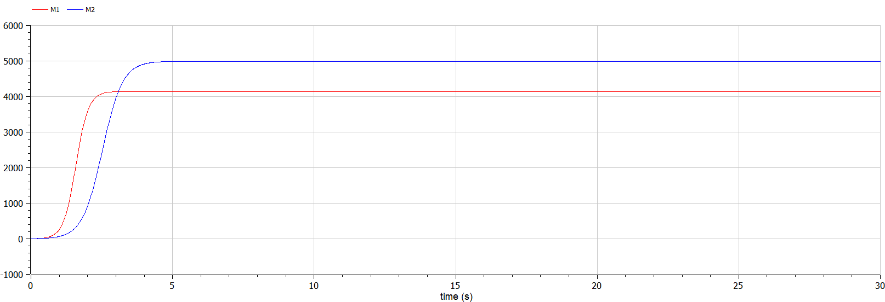
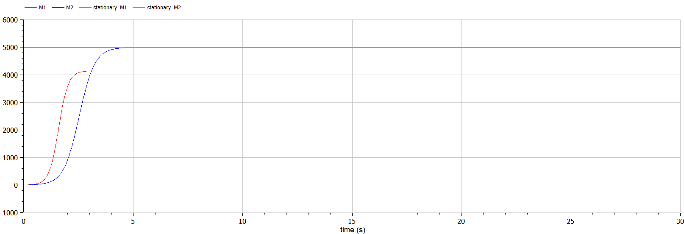
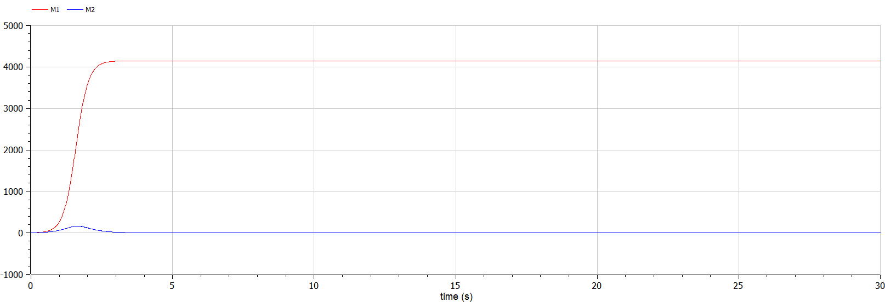

<style>
table {
    border-collapse: collapse;
    border-spacing: 0;
    border: none;
}
th {
    font-size: 25px;
}
td {
    font-size: 25px;
}
img[alt="center"] {
    display: block;
    margin: 0 auto;
}
h1 {
    font-size: 60px;
    text-align: center;
}
h2 {
    font-size: 30px;
    text-align: left;
    position: relative;
    left: -2em;
    line-height: 0px;
    top: 8em;
}
h3 {
    font-size: 40px;
    text-align: left;
    position: relative;
    left: -0em;
    bottom: 0.2em;
}
h4 {
    text-align: center;
    position: relative;
    bottom: 1.2em;
}
h5 {
    font-size: 20px;
    text-align: center;
    position: relative;
    bottom: 3em;
}
</style>

# Лабораторная работа №8
## Ilyinsky A. Arseniy 
## RUDN University, 2022 Moscow, Russia

---

# Прагматика выполнения лабораторной работы

---

### Прагматика выполнения лабораторной работы:
- Знакомство с простейшей **моделью конкуренции двух фирм**.
- Визуализация результатов моделирования путем построения и анализа графиков.

---

# Цель лабораторной работы

---

### Цель лабораторной работы:
- Научиться строить модели конкуренции двух фирм для двух случаев:
    - товары одинакового качества и находящиеся в одной рыночной нише.
    - использование социально-психологических факторов – формирование общественного предпочтения одного товара другому, не зависимо от их качества и цены.
- Научиться решать систему дифференциальных уравнений и строить графики изменения оборотных средств фирмы $1$ и фирмы $2$.


---

# Задание лабораторной работы

---

### Постановка задачи лабораторной работы:
- *Случай 1*:
  Рассмотрим две фирмы, производящие взаимозаменяемые товары одинакового качества и находящиеся в одной рыночной нише. Динамика изменения объемов продаж фирмы $1$ и фирмы $2$ описывается следующей системой уравнений:

$$
\begin{cases} 
      \frac{\partial M_1}{\partial \theta} = M_1 - \frac{b}{c_1} M_1 M_2 - \frac{a_1}{c_1} M_1^2  
      \\ \frac{\partial M_2}{\partial \theta} = \frac{c_2}{c_1} M_2 -\frac{b}{c_1} M_1 M_2 - \frac{a_2}{c_1} M_2^2 
  \end{cases}
$$

---

- *Случай 2*:
  Рассмотрим модель, когда, помимо экономического фактора влияния (изменение себестоимости, производственного цикла, использование кредита и т.п.), используются еще и социально-психологические факторы – формирование  общественного предпочтения одного товара другому, не зависимо от их качества и цены.

$$
\begin{cases} 
    \frac{\partial M_1}{\partial \theta} = M_1 - \frac{b}{c_1} M_1 M_2 - \frac{a_1}{c_1} M_1^2  
    \\ \frac{\partial M_2}{\partial \theta} = \frac{c_2}{c_1} M_2 - ( \frac{b}{c_1} + 0.00026 ) M_1 M_2 - \frac{a_2}{c_1} M_2^2 
\end{cases}
$$

Начальные условия и параметры модели:

$$
M_0^1 = 3, M_0^2 = 4, \\
p_{cr} = 45, N = 30, q = 1, \\
\tau_1 = 21, \tau_2 = 18, \\
\tilde p_1 = 8, \tilde p_2 = 13
$$

---

### Задание лабораторной работы:
1. Постройте графики изменения оборотных средств фирмы $1$ и фирмы $2$ без учета постоянных издержек и с веденной нормировкой для *случая 1*.
2. Постройте графики изменения оборотных средств фирмы $1$ и фирмы $2$ без учета постоянных издержек и с веденной нормировкой для *случая 2*.

---

# Результаты выполнения лабораторной работы

---

### 2. Программная часть
- Случай: товары одинакового качества:

```matlab
model lab8_1
  constant Real p_cr = 45; // критическая стоимость продукта
  constant Real N = 30; // число потребителей производимого
                        // продукта
  constant Real q = 1; // максимальная потребность одного 
                       // человека в продукте в единицу 
                       // времени 
  constant Real tau_1 = 21; // длительность производственного 
                            // цикла фирмы 1
  constant Real tau_2 = 18; // длительность производственного 
                           // цикла фирмы 2
  constant Real p_tilda_1 = 8; // себестоимость продукта, 
                                 // то есть переменные 
                                 // издержки на производство 
                                 // единицы продукции фирмы 1
  constant Real p_tilda_2 = 13; // себестоимость продукта, то 
                                // есть переменные издержки 
                                // на производство единицы 
                                // продукции фирмы 2
  
  
  constant Real a1 = p_cr/((tau_1^2)*(p_tilda_1^2)*N*q); 
  constant Real a2 = p_cr/((tau_2^2)*(p_tilda_2^2)*N*q);
  constant Real b = p_cr/((tau_1^2)*(p_tilda_1^2)*(tau_2^2)*(p_tilda_2^2)*N*q);
  constant Real c1 = (p_cr-p_tilda_1)/(tau_1*p_tilda_1);
  constant Real c2 = (p_cr-p_tilda_2)/(tau_2*p_tilda_2);
  
  Real M1; // оборотные средства предприятия 1
  Real M2; // оборотные средства предприятия 2
  
  Real stationary_M1; // стационарное состояние фирмы 1
  Real stationary_M2; // стационарное состояние фирмы 2
  
  Real teta; // безразмерное время

initial equation
  M1 = 3; // начальное значение M1(0)
  M2 = 4; // начальное значение M2(0)
  teta = 0; // начальное значение teta(0)

equation
  teta = time/c1; // безразмерное время - нормировка
  
  stationary_M1 = (c1*a2-b*c2)/(a1*a2-b^2); // стационарное состояние фирмы 1
  stationary_M2 = (a1*c2-b*c1)/(a1*a2-b^2); // стационарное состояние фирмы 2
  
  der(M1)/der(teta)=M1-(b/c1)*M1*M2-(a1/c1)*M1^2; // динамика изменения 
                                                  // объемов продаж фирмы 1
  der(M2)/der(teta)=(c2/c1)*M2-(b/c1)*M1*M2-(a2/c1)*M2^2; // динамика изменения объемов 
                                                                  // продаж фирмы 2
  
end lab8_1;
```
    
---

- Случай: предпочтения одного товара другому, не зависимо от их качества:

```matlab
model lab8_2
  constant Real p_cr = 45; // критическая стоимость продукта
  constant Real N = 30; // число потребителей производимого
                        // продукта
  constant Real q = 1; // максимальная потребность одного 
                       // человека в продукте в единицу 
                       // времени 
  constant Real tau_1 = 21; // длительность производственного 
                            // цикла фирмы 1
  constant Real tau_2 = 18; // длительность производственного 
                           // цикла фирмы 2
  constant Real p_tilda_1 = 8; // себестоимость продукта, 
                                 // то есть переменные 
                                 // издержки на производство 
                                 // единицы продукции фирмы 1
  constant Real p_tilda_2 = 13; // себестоимость продукта, то 
                                // есть переменные издержки 
                                // на производство единицы 
                                // продукции фирмы 2
  
  
  constant Real a1 = p_cr/((tau_1^2)*(p_tilda_1^2)*N*q); 
  constant Real a2 = p_cr/((tau_2^2)*(p_tilda_2^2)*N*q);
  constant Real b = p_cr/((tau_1^2)*(p_tilda_1^2)*(tau_2^2)*(p_tilda_2^2)*N*q);
  constant Real c1 = (p_cr-p_tilda_1)/(tau_1*p_tilda_1);
  constant Real c2 = (p_cr-p_tilda_2)/(tau_2*p_tilda_2);
  
  Real M1; // оборотные средства предприятия 1
  Real M2; // оборотные средства предприятия 2
  
  Real teta; // безразмерное время

initial equation
  M1 = 3; // начальное значение M1(0)
  M2 = 4; // начальное значение M2(0)
  teta = 0; // начальное значение teta(0)

equation
  teta = time/c1; // безразмерное время - нормировка
  
  der(M1)/der(teta)=M1-(b/c1)*M1*M2-(a1/c1)*M1^2; // динамика изменения 
                                                  // объемов продаж фирмы 1
  der(M2)/der(teta)=(c2/c1)*M2-(b/c1+0.00026)*M1*M2-(a2/c1)*M2^2; // динамика изменения объемов 
                                                                  // продаж фирмы 2
  
end lab8_2;
```

---

### 2. Построение и анализ графиков

- График изменения оборотных средств фирмы $1$ и фирмы $2$ в случае 1:

#### 
##### Рис. 1: График изменения оборотных средств фирмы 1 и фирмы 2

---

- Стационарное состояние системы для первого случая: 

#### 
##### Рис. 2: Стационарное состояние системы

---

- График изменения оборотных средств фирмы $1$ и фирмы $2$ в случае 2:
#### 
##### Рис. 3: График изменения оборотных средств фирмы 1 и фирмы 2

---

# Спасибо за внимание