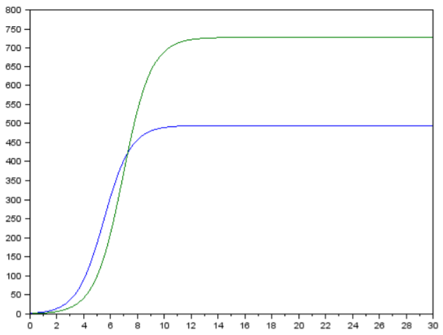
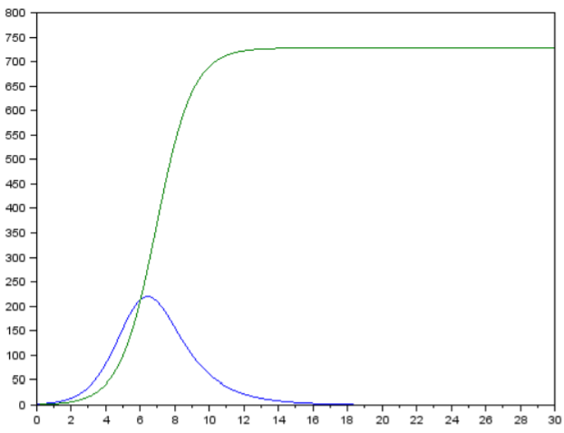
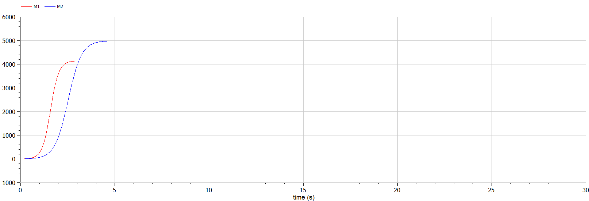
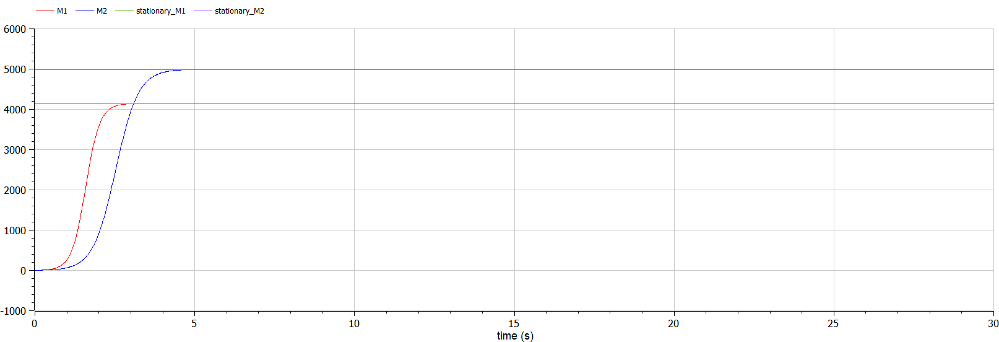
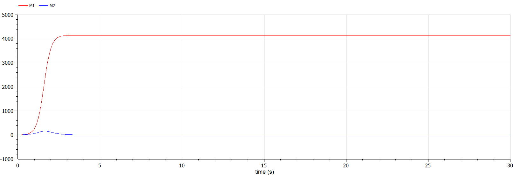

---
# Front matter
lang: ru-RU
title: "Лабораторная работа №8"
subtitle: "Математическое моделирование"
author: "Ильинский Арсений Александрович"

# Formatting
toc-title: "Содержание"
toc: true # Table of contents
toc_depth: 2
lof: true # List of figures
lot: true # List of tables
fontsize: 12pt
linestretch: 1.5
papersize: a4paper
documentclass: scrreprt
polyglossia-lang: russian
polyglossia-otherlangs: english
mainfont: PT Serif
romanfont: PT Serif
sansfont: PT Sans
monofont: PT Mono
mainfontoptions: Ligatures=TeX
romanfontoptions: Ligatures=TeX
sansfontoptions: Ligatures=TeX,Scale=MatchLowercase
monofontoptions: Scale=MatchLowercase
indent: true
pdf-engine: lualatex
header-includes:
  - \usepackage[russian]{babel}
  - \linepenalty=10 # the penalty added to the badness of each line within a paragraph (no associated penalty node) Increasing the value makes tex try to have fewer lines in the paragraph.
  - \interlinepenalty=0 # value of the penalty (node) added after each line of a paragraph.
  - \hyphenpenalty=50 # the penalty for line breaking at an automatically inserted hyphen
  - \exhyphenpenalty=50 # the penalty for line breaking at an explicit hyphen
  - \binoppenalty=700 # the penalty for breaking a line at a binary operator
  - \relpenalty=500 # the penalty for breaking a line at a relation
  - \clubpenalty=150 # extra penalty for breaking after first line of a paragraph
  - \widowpenalty=150 # extra penalty for breaking before last line of a paragraph
  - \displaywidowpenalty=50 # extra penalty for breaking before last line before a display math
  - \brokenpenalty=100 # extra penalty for page breaking after a hyphenated line
  - \predisplaypenalty=10000 # penalty for breaking before a display
  - \postdisplaypenalty=0 # penalty for breaking after a display
  - \floatingpenalty = 20000 # penalty for splitting an insertion (can only be split footnote in standard LaTeX)
  - \raggedbottom # or \flushbottom
  - \usepackage{float} # keep figures where there are in the text
  - \floatplacement{figure}{H} # keep figures where there are in the text
---

# Цель работы

Рассмотреть простейшую **модель конкуренции двух фирм**. Построить модель и визуализировать и анализировать графики изменения оборотных средств фирмы $1$ и фирмы $2$ для двух случаев.

# Задание

**Вариант 46**

- *Случай 1*:

  Рассмотрим две фирмы, производящие взаимозаменяемые товары одинакового качества и находящиеся в одной рыночной нише. Считаем, что в рамках нашей модели конкурентная борьба ведётся только рыночными методами. То есть, конкуренты могут влиять на противника путем изменения параметров своего  производства: себестоимость, время цикла, но не могут прямо вмешиваться в ситуацию на рынке («назначать» цену или влиять на потребителей каким-либо иным способом). Будем считать, что постоянные издержки пренебрежимо малы, и в модели учитывать не будем. В этом случае динамика изменения объемов продаж фирмы $1$ и фирмы $2$ описывается следующей системой уравнений:
  
  $$
  \begin{cases} 
        \frac{\partial M_1}{\partial \theta} = M_1 - \frac{b}{c_1} M_1 M_2 - \frac{a_1}{c_1} M_1^2  
        \\ \frac{\partial M_2}{\partial \theta} = \frac{c_2}{c_1} M_2 -\frac{b}{c_1} M_1 M_2 - \frac{a_2}{c_1} M_2^2 
    \end{cases}
  $$
  
  где $a_1 = \frac{p_{cr}}{\tau_1^2 \tilde p_1^2 N q}$, $a_2 = \frac{p_{cr}}{\tau_2^2 \tilde p_2^2 N q}$, $b = \frac{p_{cr}}{\tau_1^2 \tilde p_1^2 \tau_2^2 \tilde p_2^2N q}$, $c_1 = \frac{p_{cr} - \tilde p_1}{\tau_1 \tilde p_1}$, $c_2 = \frac{p_{cr} - \tilde p_2}{\tau_2 \tilde p_2}$.
  
  Также введена нормировка $t = c_1 \theta$.
  
- *Случай 2*:

  Рассмотрим модель, когда, помимо экономического фактора влияния (изменение себестоимости, производственного цикла, использование кредита и т.п.), используются еще и социально-психологические факторы – формирование общественного предпочтения одного товара другому, не зависимо от их качества и цены. В этом случае взаимодействие двух фирм будет зависеть друг от друга, соответственно коэффициент перед $M_1 M_2$ будет отличаться. Пусть в рамках рассматриваемой модели динамика изменения объемов продаж фирмы $1$ и фирмы $2$ описывается следующей системой уравнений:
  $$
  \begin{cases} 
      \frac{\partial M_1}{\partial \theta} = M_1 - \frac{b}{c_1} M_1 M_2 - \frac{a_1}{c_1} M_1^2  
      \\ \frac{\partial M_2}{\partial \theta} = \frac{c_2}{c_1} M_2 - ( \frac{b}{c_1} + 0.00026 ) M_1 M_2 - \frac{a_2}{c_1} M_2^2 
  \end{cases}
  $$

Для обоих случаев рассмотрим задачу со следующими начальными условиями и параметрами:

$$
M_0^1 = 3, M_0^2 = 4,
$$
$$
p_{cr} = 45, N = 30, q = 1,
$$
$$
\tau_1 = 21, \tau_2 = 18,
$$
$$
\tilde p_1 = 8, \tilde p_2 = 13
$$

**Замечание**: значения $p_{cr}$, $\tilde p_{1,2}$, $N$ указаны в тысячах единиц, а значения $M_{1, 2}$ указаны в млн. единиц.

**Обозначения**:

- $N$ — число потребителей производимого продукта.
- $\tau$ — длительность производственного цикла.
- $p$ — рыночная цена товара.
- $\tilde p$ — себестоимость продукта, то есть переменные издержки на производство единицы продукции.
- $q$ — максимальная потребность одного человека в продукте в единицу времени.
- $\theta$ — безразмерное время.

**Задание**:

1. Постройте графики изменения оборотных средств фирмы $1$ и фирмы $2$ без учета постоянных издержек и с веденной нормировкой для *случая 1*.
2. Постройте графики изменения оборотных средств фирмы $1$ и фирмы $2$ без учета постоянных издержек и с веденной нормировкой для *случая 2*.

# Теоретическое введение

## Модель одной фирмы

Для построения модели конкуренции хотя бы двух фирм необходимо рассмотреть модель одной фирмы. Вначале рассмотрим модель фирмы,производящей продукт долговременного пользования, когда цена его определяется балансом спроса и предложения. Примем, что этот продукт занимает определенную нишу рынка и конкуренты в ней отсутствуют.

Обозначим:

- $N$ — число потребителей производимого продукта.
- $S$ — доходы потребителей данного продукта. Считаем, что доходы всех потребителей одинаковы. Это предположение справедливо, если речь идет об одной рыночной нише, т.е. производимый продукт ориентирован на определенный слой населения.
- $M$ — оборотные средства предприятия.
- $\tau$ — длительность производственного цикла.
- $p$ — рыночная цена товара.
- $\tilde p$ — себестоимость продукта, то есть переменные издержки на производство единицы продукции.
- $\delta$ — доля оборотных средств, идущая на покрытие переменных издержек.
- $\kappa$ — постоянные издержки, которые не зависят от количества выпускаемой продукции.

$Q(S/p)$ — функция спроса, зависящая от отношения дохода S к цене p. Она равна количеству продукта, потребляемого одним потребителем в единицу времени.

Функцию спроса товаров долговременного использования часто представляют в простейшей форме:

$$
\tag{1} Q = q - k \frac{P}{S} = q(1 - \frac{p}{p_{cr}})
$$

где:

- $q$ — максимальная потребность одного человека в продукте в единицу времени. 

Эта функция падает с ростом цены и при $p = p_{cr}$ (критическая стоимость продукта) потребители отказываются от приобретения товара. Величина $p_{cr} = Sq/k$. Параметр $k$ — мера эластичности функции спроса по цене. Таким образом, функция спроса в форме $(1)$ является пороговой (то есть, $Q(S/p) = 0$ при $p \geq p_{cr}$) и обладает свойствами насыщения.

Уравнения динамики оборотных средств можно записать в виде
$$
 \tag{2} \frac{\partial M}{\partial t} = -\frac{M \delta}{\tau} + NQp - \kappa = -\frac{M \delta}{\tau} + NQ(1 - \frac{p}{p_{cr}})p - \kappa
$$
Уравнение для рыночной цены p представим в виде
$$
 \tag{3} \frac{\partial p}{\partial t} = \gamma (-\frac{M \delta}{\tau \tilde{p}} + NQ(1 - \frac{p}{p_{cr}}) 
$$
Первый член соответствует количеству поставляемого на рынок товара (то есть, предложению), а второй член – спросу.

Параметр $\gamma$ зависит от скорости оборота товаров на рынке. Как правило, время торгового оборота существенно меньше времени производственного цикла $\tau$. При заданном $M$ уравнение $(3)$ описывает быстрое стремление цены к равновесному значению цены, которое устойчиво.

В этом случае уравнение $(3)$ можно заменить алгебраическим соотношением:

$$
\tag{4} -\frac{M \delta}{\tau \tilde{p}} + NQ(1 - \frac{p}{p_{cr}}) = 0 
$$

Из $(4)$ следует, что равновесное значение цены p равно:

$$
\tag{5} p = p_{cr}(1 - \frac{M \delta}{\tau \tilde{p} Nq})
$$

Уравнение $(2)$ с учетом $(5)$ приобретает вид:

$$
\tag{6} \frac{\partial M}{\partial t} = M \frac{\delta}{\tau}(\frac{p_{cr}}{\tilde{p}} - 1) - M^2 (\frac{\delta}{\tau \delta{p}})^2 \frac{p_{cr}}{Nq} - \kappa
$$

Уравнение $(6)$ имеет два стационарных решения, соответствующих условию $\partial M / \partial t = 0$:

$$
\tag{7} \tilde{M}_{1,2} = \frac{1}{2}a \pm \sqrt{\frac{a^2}{4} - b}
$$

где

$$
\tag{8} a = Nq(1 - \frac{\tilde{p}}{p_{cr}}) \tilde{p} \frac{\tau}{\delta}, b = \kappa Nq \frac{(\tau \tilde{p})^2}{p_{cr} \delta^2} 
$$

Из $(7)$ следует, что при больших постоянных издержках (в случае $a^2 < 4b$) стационарных состояний нет. Это означает, что в этих условиях фирма не может функционировать стабильно, то есть, терпит банкротство. Однако, как правило, постоянные затраты малы по сравнению с переменнымии (то есть, $b \ll a^2$) играют роль, только в случае, когда оборотные средства малы. При $b \ll a$ стационарные значения $M$ равны:

$$
\tag{9} \tilde{M}_{+} = Nq \frac{\tau}{\delta}(1 - \frac{\tilde{p}}{p*{cr}}) \tilde{p}, \tilde{M}_{-} = \kappa \tilde{p} \frac{\tau}{\delta(p*{cr} - \tilde{p})}
$$

Первое состояние $\tilde{M}_{+}$ устойчиво и соответствует стабильному функционированию предприятия. Второе состояние $\tilde{M}_{-}$ неустойчиво, так что при $M < \tilde{M}_{-}$ оборотные средства падают ($\partial M / \partial t < 0$), то есть, фирма идет к банкротству. По смыслу $\tilde{M}_{-}$ соответствует начальному капиталу, необходимому для входа в рынок.

В обсуждаемой модели параметр $\delta$ всюду входит в сочетании с $\tau$. Это значит, что уменьшение доли оборотных средств, вкладываемых в производство, эквивалентно удлинению производственного цикла. Поэтому мы в дальнейшем положим: $\delta = 1$, а параметр $\tau$ будем считать временем цикла, с учётом сказанного.

## Конкуренция двух фирм

### Случай 1

Рассмотрим две фирмы, производящие взаимозаменяемые товары одинакового качества и находящиеся в одной рыночной нише. Последнее означает, что у потребителей в этой нише нет априорных предпочтений, и они приобретут тот или иной товар, не обращая внимания на знак фирмы.

В этом случае, на рынке устанавливается единая цена, которая определяется балансом суммарного предложения и спроса. Иными словами, в рамках нашей модели конкурентная борьба ведётся только рыночными методами. То есть, конкуренты могут влиять на противника путем изменения параметров своего производства: себестоимость, время цикла, но не могут прямо вмешиваться в ситуацию на рынке («назначать» цену или влиять на потребителей каким-либо иным способом).

Уравнения динамики оборотных средств запишем по аналогии с $(2)$ в виде

$$
 \tag{10} \begin{cases} \frac{\partial M_1}{\partial t} = - \frac{M_1}{\tau_1} + N_1q(1 - \frac{p}{p_{cr}})p - \kappa_1 \ \\ \frac{\partial M_2}{\partial t} = - \frac{M_2}{\tau_2} + N_2q(1 - \frac{p}{p_{cr}})p - \kappa_2 \end{cases}
$$

где использованы те же обозначения, а индексы $1$ и $2$ относятся к первой и второй фирме, соответственно. Величины $N_1$ и $N_2$ — числа потребителей, приобретших товар первой и второй фирмы.

Учтем, что товарный баланс устанавливается быстро, то есть, произведенный каждой фирмой товар не накапливается, а реализуется по цене $p$. 

Тогда:

$$
\tag{11} \begin{cases} \frac{M_1}{\tau_1 \tilde{p}*1} = - N_1q(1 - \frac{p}{p*{cr}}) \ \\ \frac{M_2}{\tau_2 \tilde{p}*2} = - N_2q(1 - \frac{p}{p*{cr}}) \end{cases}
$$

где $\tilde{p}_1$ и $\tilde{p}_2$ — себестоимости товаров в первой и второй фирме.

С учетом $(10)$ представим $(11)$ в виде:

$$
\tag{12} \begin{cases} \frac{\partial M_1}{\partial t} = - \frac{M_1}{\tau_1}(1 - \frac{p}{\tilde{p}_1}) - \kappa_1 \ \\ \frac{\partial M_2}{\partial t} = - \frac{M_2}{\tau_2}(1 - \frac{p}{\tilde{p}_2}) - \kappa_2 \end{cases}
$$

Уравнение для цены, по аналогии с $(3)$,

$$
\tag{13} \frac{\partial p}{\partial t} = - \gamma (\frac{M_1}{\tau_1 \tilde{p}_1} + \frac{M_2}{\tau_2 \tilde{p}*2} - Nq (1 - \frac{p}{p*{cr}}) 
$$

Считая, как и выше, что ценовое равновесие устанавливается быстро, получим:

$$
\tag{14} p = p_{cr} (1 - \frac{1}{Nq} (\frac{M_1}{\tau_1 \tilde{p}_1} + \frac{M_2}{\tau_2 \tilde{p}_2})) 
$$

Подставив $(14)$ в $(12)$ имеем:

$$
\tag{15} \begin{cases} \frac{\partial M_1}{\partial t} = c_1 M_1 - b M_1 M_2 - a_1 M_1^2 - \kappa_1 \ \\ \frac{\partial M_2}{\partial t} = c_2 M_2 - b M_1 M_2 - a_2 M_2^2 - \kappa_2 \end{cases} 
$$

где

$$
\tag{16} a_1 = \frac{p_{cr}}{\tau_1^2 \tilde{p}*1^2 Nq}, a_2 = \frac{p_{cr}}{\tau_2^2 \tilde{p}_2^2 Nq}, b = \frac{p_{cr}}{\tau_1^2 \tilde{p}_1^2 \tau_2^2 \tilde{p}_2^2 Nq}, c_1 = \frac{p_{cr} - \tilde{p}_1}{\tau_1^2 \tilde{p}_1^2}, c_2 = \frac{p_{cr} - \tilde{p}_2}{\tau_2^2 \tilde{p}_2^2}
$$

Исследуем систему $(15)$ в случае, когда постоянные издержки ($\kappa_1$, $\kappa_2$) пренебрежимо малы. И введем нормировку $t = c_1 \theta$.Получим следующую систему:

$$
\tag{17} \begin{cases} \frac{\partial M_1}{\partial \theta} = M_1 - \frac{b}{c_1} M_1 M_2 - \frac{a_1}{c_1} M_1^2 \ \\ \frac{\partial M_2}{\partial \theta} = \frac{c_2}{c_1} M_2 -\frac{b}{c_1} M_1 M_2 - \frac{a_2}{c_1} M_2^2 \end{cases}
$$

**Замечание**: необходимо учесть, что значения $p_{cr}$, $\tilde p_{1, 2}$, $N$ указаны в тысячах единиц (например $N = 10$ — означает $10 000$ потенциальных потребителей), а значения $M_{1, 2}$ указаны в млн. единиц.

При таких условиях получаем следующие динамики изменения объемов продаж (рис. [-@fig:001]):

{#fig:1 width=70%}

*Пояснение*: график изменения оборотных средств фирмы $1$ (синий) и фирмы $2$ (зеленый). По оси ординат значения $M_{1, 2}$, по оси абсцисс значения $\theta = \frac{t}{c_1}$ (безразмерное время).

По графику видно, что рост оборотных средств предприятий идет независимо друг от друга. В математической модели $(17)$ этот факт отражается в коэффициенте, стоящим перед членом $M_1 M_2$: в рассматриваемой задаче он одинаковый в обоих уравнениях ($\frac{b}{c_1}$). Это было обозначено в условиях задачи. Каждая фирма достигает свое максимальное значение объема продаж и остается на рынке с этим значением, то есть каждая фирма захватывает свою часть рынка потребителей, которая не изменяется. 

### Нахождение стационарного состояние для случая 1

Приравниваем первое уравнение из системы $(17)$ к нулю и находим корни:
$$
\begin{cases} 
    x_1 = 0 \\ 
    x_2 = \frac{c_1 - by}{a_1} 
\end{cases}
$$
Отбрасываем $0$, потому что он не может быть стационарным состоянием, и находим вторую точку:
$$
\begin{cases} 
    x = \frac{c_1 - by}{a_1} \\ 
    y = \frac{a_1 c_2 - b c_1}{a_1 a_2 - b^2} \end{cases}
$$
Подставляем значение $y$ и получаем:
$$
\tag{18} 
\begin{cases} 
    x = \frac{c_1 a_2 - b c_2}{a_1 a_2 - b^2} \\ 
    y = \frac{a_1 c_2 - b c_1}{a_1 a_2 - b^2} 
\end{cases}
$$

### Случай 2

Рассмотрим модель, когда, помимо экономического фактора влияния (изменение себестоимости, производственного цикла, использование кредита и т.п.), используются еще и социально-психологические факторы — формирование общественного предпочтения одного товара другому, не зависимо от их качества и цены. В этом случае взаимодействие двух фирм будет зависеть друг от друга, соответственно коэффициент перед $M1 M2$ будет отличаться. 

Рассмотрим следующую модель:
$$
\tag{19}
\begin{cases} 
    \frac{\partial M_1}{\partial \theta} = M_1 - ( \frac{b}{c_1} + 0.002 ) M_1 M_2 - \frac{a_1}{c_1} M_2^2  \\
    \frac{\partial M_2}{\partial \theta} = \frac{c_2}{c_1} M_2 - \frac{b}{c_1} M_1 M_2 - \frac{a_2}{c_1} M_2^2
\end{cases}
$$
Начальные условия и известные параметры остаются прежними. В этом случаем получим следующее решение (рис. [-@fig:002]):

{#fig:2 width=70%}

*Пояснение*: график изменения оборотных средств фирмы $1$ (синий) и фирмы $2$ (зеленый). По оси ординат значения $M_{1, 2}$, по оси абсцисс значения $\theta = \frac{t}{c_1}$ (безразмерное время).

По графику видно, что первая фирма, несмотря на начальный рост, достигнув своего максимального объема продаж, начитает нести убытки и, в итоге, терпит банкротство. Динамика роста объемов оборотных средств второй фирмы остается без изменения: достигнув максимального значения, остается на этом уровне. 

**Замечание**: стоит отметить, что рассматривается упрощенная модель, которая дает модельное решение. В реальности факторов, влияющих на динамику изменения оборотных средств предприятий, больше.

# Выполнение лабораторной работы

## 1. Моделирование и построение графиков

### 1.1.  Случай: товары одинакового качества и находящиеся в одной рыночной нише

1. Модель:

   $$
   \begin{cases} 
         \frac{\partial M_1}{\partial \theta} = M_1 - \frac{b}{c_1} M_1 M_2 - \frac{a_1}{c_1} M_1^2  
         \\ \frac{\partial M_2}{\partial \theta} = \frac{c_2}{c_1} M_2 -\frac{b}{c_1} M_1 M_2 - \frac{a_2}{c_1} M_2^2 
     \end{cases}
   $$
   
   где:
   
   $$
   M_0^1 = 3, M_0^2 = 4,
   $$
   $$
   p_{cr} = 45, N = 30, q = 1,
   $$
   $$
   \tau_1 = 21, \tau_2 = 18,
   $$
   $$
   \tilde p_1 = 8, \tilde p_2 = 13
   $$
   
2. Код программы с комментариями:

   ```matlab
   // Модель конкуренции двух фирм
   // случай: две фирмы, производящие взаимозаменяемые товары
   // одинакового качества и находящиеся в одной рыночной нише
   
   model lab8_1
     constant Real p_cr = 45; // критическая стоимость продукта
     constant Real N = 30; // число потребителей производимого
                           // продукта
     constant Real q = 1; // максимальная потребность одного 
                          // человека в продукте в единицу 
                          // времени 
     constant Real tau_1 = 21; // длительность производственного 
                               // цикла фирмы 1
     constant Real tau_2 = 18; // длительность производственного 
                              // цикла фирмы 2
     constant Real p_tilda_1 = 8; // себестоимость продукта, 
                                    // то есть переменные 
                                    // издержки на производство 
                                    // единицы продукции фирмы 1
     constant Real p_tilda_2 = 13; // себестоимость продукта, то 
                                   // есть переменные издержки 
                                   // на производство единицы 
                                   // продукции фирмы 2
     
     
     constant Real a1 = p_cr/((tau_1^2)*(p_tilda_1^2)*N*q); 
     constant Real a2 = p_cr/((tau_2^2)*(p_tilda_2^2)*N*q);
     constant Real b = p_cr/((tau_1^2)*(p_tilda_1^2)*(tau_2^2)*(p_tilda_2^2)*N*q);
     constant Real c1 = (p_cr-p_tilda_1)/(tau_1*p_tilda_1);
     constant Real c2 = (p_cr-p_tilda_2)/(tau_2*p_tilda_2);
     
     Real M1; // оборотные средства предприятия 1
     Real M2; // оборотные средства предприятия 2
     
     Real stationary_M1; // стационарное состояние фирмы 1
     Real stationary_M2; // стационарное состояние фирмы 2
     
     Real teta; // безразмерное время
   
   initial equation
     M1 = 3; // начальное значение M1(0)
     M2 = 4; // начальное значение M2(0)
     teta = 0; // начальное значение teta(0)
   
   equation
     teta = time/c1; // безразмерное время - нормировка
     
     stationary_M1 = (c1*a2-b*c2)/(a1*a2-b^2); // стационарное состояние фирмы 1
     stationary_M2 = (a1*c2-b*c1)/(a1*a2-b^2); // стационарное состояние фирмы 2
     
     der(M1)/der(teta)=M1-(b/c1)*M1*M2-(a1/c1)*M1^2; // динамика изменения 
                                                     // объемов продаж фирмы 1
     der(M2)/der(teta)=(c2/c1)*M2-(b/c1)*M1*M2-(a2/c1)*M2^2; // динамика изменения объемов 
                                                                     // продаж фирмы 2
     
   end lab8_1;
   ```
   
3. График распространения рекламы (рис. [-@fig:003]):

   {#fig:3 width=70%}
   
   *Пояснение*: график изменения оборотных средств фирмы $1$ ($M_1$ — <span style="color:red">красный</span>) и фирмы $2$ ($M_2$— <span style="color:blue">синий</span>), где по вертикальной оси значения $M_{1, 2}$ (оборотные средства предприятия $1$ и $2$) с нормировкой ($\theta = \frac{t}{c_1}$ (безразмерное время)), по горизонтальной оси значения $t$ (времени).

   **Замечание**: таким образом, по графику видно, что каждая фирма достигает свое максимальное значение объема продаж и остается на рынке с этим значением, то есть каждая фирма захватывает свою часть рынка потребителей, которая не изменяется.
   
4. Стационарное состояние системы для первого случая (рис. [-@fig:004]):

   {#fig:4 width=70%}

   *Пояснение*: стационарное состояние системы (т.е. состояние, когда предприятия выйдут на максимум своей мощности), где:

   - <span style="color:green">зеленый</span> — стационарное состояние фирмы $1$ ($M_1$ — <span style="color:red">красный</span>).
   - <span style="color:purple">фиолетовый</span> — стационарное состояние фирмы $2$ ($M_2$ — <span style="color:blue">синий</span>).
   
   **Замечание**: данные состояния я нашел, решив систему уравнений $(18)$.

### 1.2.  Случай: использование социально-психологических факторов – формирование общественного предпочтения одного товара другому, не зависимо от их качества и цены

1. Модель:

   $$
   \begin{cases} 
          \frac{\partial M_1}{\partial \theta} = M_1 - \frac{b}{c_1} M_1 M_2 - \frac{a_1}{c_1} M_1^2  
          \\ \frac{\partial M_2}{\partial \theta} = \frac{c_2}{c_1} M_2 - ( \frac{b}{c_1} + 0.00026 ) M_1 M_2 - \frac{a_2}{c_1} M_2^2 
      \end{cases}
   $$
   
   где:
   
   $$
   M_0^1 = 3, M_0^2 = 4,
   $$
   $$
   p_{cr} = 45, N = 30, q = 1,
   $$
   $$
   \tau_1 = 21, \tau_2 = 18,
   $$
   $$
   \tilde p_1 = 8, \tilde p_2 = 13
   $$

2. Код программы с комментариями:

   ```matlab
   // Модель конкуренции двух фирм
   // случай: помимо экономического фактора
   // влияния (изменение себестоимости, производственного цикла, 
   // использование кредита и т.п.), используются еще и 
   // социально-психологические факторы – формирование общественного 
   // предпочтения одного товара другому, не зависимо от их качества и цены.
   
   model lab8_2
     constant Real p_cr = 45; // критическая стоимость продукта
     constant Real N = 30; // число потребителей производимого
                           // продукта
     constant Real q = 1; // максимальная потребность одного 
                          // человека в продукте в единицу 
                          // времени 
     constant Real tau_1 = 21; // длительность производственного 
                               // цикла фирмы 1
     constant Real tau_2 = 18; // длительность производственного 
                              // цикла фирмы 2
     constant Real p_tilda_1 = 8; // себестоимость продукта, 
                                    // то есть переменные 
                                    // издержки на производство 
                                    // единицы продукции фирмы 1
     constant Real p_tilda_2 = 13; // себестоимость продукта, то 
                                   // есть переменные издержки 
                                   // на производство единицы 
                                   // продукции фирмы 2
     
     
     constant Real a1 = p_cr/((tau_1^2)*(p_tilda_1^2)*N*q); 
     constant Real a2 = p_cr/((tau_2^2)*(p_tilda_2^2)*N*q);
     constant Real b = p_cr/((tau_1^2)*(p_tilda_1^2)*(tau_2^2)*(p_tilda_2^2)*N*q);
     constant Real c1 = (p_cr-p_tilda_1)/(tau_1*p_tilda_1);
     constant Real c2 = (p_cr-p_tilda_2)/(tau_2*p_tilda_2);
     
     Real M1; // оборотные средства предприятия 1
     Real M2; // оборотные средства предприятия 2
     
     Real teta; // безразмерное время
   
   initial equation
     M1 = 3; // начальное значение M1(0)
     M2 = 4; // начальное значение M2(0)
     teta = 0; // начальное значение teta(0)
   
   equation
     teta = time/c1; // безразмерное время - нормировка
     
     der(M1)/der(teta)=M1-(b/c1)*M1*M2-(a1/c1)*M1^2; // динамика изменения 
                                                     // объемов продаж фирмы 1
     der(M2)/der(teta)=(c2/c1)*M2-(b/c1+0.00026)*M1*M2-(a2/c1)*M2^2; // динамика изменения объемов 
                                                                     // продаж фирмы 2
     
   end lab8_2;
   ```
   
3. График распространения рекламы (рис. [-@fig:005]):

   {#fig:5 width=70%}

   *Пояснение*: график изменения оборотных средств фирмы $1$ ($M_1$ — <span style="color:red">красный</span>) и фирмы $2$ ($M_2$— <span style="color:blue">синий</span>), где по вертикальной оси значения $M_{1, 2}$ (оборотные средства предприятия $1$ и $2$) с нормировкой ($\theta = \frac{t}{c_1}$ (безразмерное время)), по горизонтальной оси значения $t$ (времени).
   
   **Замечание**: таким образом, по графику видно, что вторая фирма ($M_2$), несмотря на начальный рост, достигнув своего максимального объема продаж, начитает нести убытки и в итоге стабилизирует ситуацию. Динамика роста объемов оборотных средств первой фирмы ($M_1$) остается без изменения: достигнув максимального значения, остается на этом уровне.

# Выводы

Благодаря данной лабораторной работе познакомился с простейшей **моделью конкуренции двух фирм**, а именно научился:

- строить модель.
- строить график изменения оборотных средств фирмы $1$ и фирмы $2$.

# Список литературы

- <code>[Кулябов Д.С. *Лабораторная работа №8*](https://esystem.rudn.ru/mod/resource/view.php?id=831057)</code>
- <code>[Кулябов Д.С. *Задания к лабораторной работе №8 ( по вариантам )*](https://esystem.rudn.ru/mod/resource/view.php?id=831058)</code>

 
